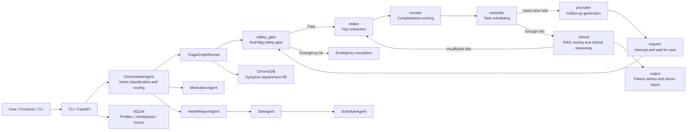

# Medi

Medi is a safety-first, multi-agent healthcare assistant backend for Chinese medical consultation scenarios. It supports intelligent triage, medication Q&A, health report interpretation, personalized diet suggestions, and schedule planning. The system exposes a CLI, FastAPI HTTP/SSE chat APIs, and PDF health report upload parsing.

This project is under active development and is being continuously improved.

> Disclaimer: Medi is built for learning, engineering practice, and health-information assistance only. It is not a medical diagnosis or treatment system. If you experience red-flag symptoms such as chest pain, difficulty breathing, altered consciousness, or heavy bleeding, seek emergency care immediately.

## Highlights

- Intelligent triage: builds an interruptible and cyclic triage state graph with LangGraph for multi-turn symptom intake, dynamic follow-up, department routing, and doctor-facing pre-consultation reports.
- Safety gate: applies deterministic red-flag rules and a semantic safety gate before LLM-driven triage; emergency signals bypass the LLM triage chain and return escalation guidance directly.
- Dynamic pre-consultation: decomposes intake into 15 subtasks across T1/T2/T3/T4, using completeness scoring, task priority, and repeated-question penalties to decide the next follow-up.
- Long-session recovery: manages LangGraph checkpoint lifecycle for interrupted questions, resume after service restart, and session actions such as `resume-state`, `restart`, and `close`.
- RAG department routing: uses ChromaDB and `BAAI/bge-large-zh-v1.5` to build a symptom-to-department vector knowledge base for the clinical reasoning node.
- Health profile memory: persists age, gender, chronic conditions, allergies, current medications, and visit history in SQLite; critical recommendations inject this profile as hard constraints.
- Multi-agent pipeline: HealthReportAgent orchestrates DietAgent and ScheduleAgent, passing structured dataclasses instead of free-form text between agents.
- Observability: records LLM calls, tool calls, stage latency, fallback events, and errors into SQLite for cost analysis and failure diagnosis.

## Tech Stack

| Area | Technologies |
| --- | --- |
| Language and service | Python 3.11+, FastAPI, Typer, Rich |
| Agent orchestration | LangGraph, LangGraph checkpoint |
| LLM providers | OpenAI-compatible API, Qwen-compatible API, Ollama fallback |
| Retrieval and storage | ChromaDB, SentenceTransformers, SQLite, aiosqlite |
| Document parsing | pypdf |
| Testing | pytest, pytest-asyncio |

## Architecture



## Quick Start

### 1. Install dependencies

```bash
python -m venv .venv
source .venv/bin/activate

python -m pip install -U pip
pip install -e ".[dev]"
```

Windows PowerShell:

```powershell
python -m venv .venv
.\.venv\Scripts\Activate.ps1

python -m pip install -U pip
pip install -e ".[dev]"
```

If you are running the LLM providers or building the knowledge base in a fresh environment, also install:

```bash
pip install openai datasets
```

### 2. Configure environment variables

Copy the example environment file:

```bash
cp .env.example .env
```

Windows PowerShell:

```powershell
Copy-Item .env.example .env
```

Common configuration:

```env
OPENAI_API_KEY=your_key_here
DASHSCOPE_API_KEY=your_dashscope_key_here

MODEL_FAST=gpt-4o-mini
MODEL_SMART=gpt-4o

MEDI_CHECKPOINTER=sqlite
MEDI_CHECKPOINT_DB=data/langgraph_checkpoints.sqlite
```

The provider chain is built dynamically from available environment variables:

- smart: OpenAI `gpt-4o` -> Qwen `qwen-max` -> local `qwen2.5:7b`
- fast: OpenAI `gpt-4o-mini` -> Qwen `qwen-turbo` -> local `qwen2.5:7b`

If no cloud API key is available, you can run Ollama locally as the final fallback:

```bash
ollama pull qwen2.5:7b
ollama serve
```

### 3. Build the symptom-department vector knowledge base

The clinical node reads the ChromaDB collection under `data/chroma`. For first-time development, build a small local index:

```bash
python -m medi.knowledge.build_index --limit 2000 --min-score 4
```

The full build downloads `FreedomIntelligence/Huatuo26M-Lite` and generates BGE embeddings. It can take significantly more time and disk space.

### 4. Start the CLI

```bash
medi
```

Use a specific user ID to load or create a persistent health profile:

```bash
medi --user-id u1
```

Inspect recent observability data:

```bash
medi observe
medi observe --session <session_id>
```

### 5. Start the HTTP service

```bash
medi serve --port 8000 --reload
```

Or run uvicorn directly:

```bash
uvicorn medi.api.app:app --reload --port 8000
```

After startup:

- API docs: http://localhost:8000/docs
- Health check: http://localhost:8000/health

## API Examples

### Regular chat

```bash
curl -X POST "http://localhost:8000/chat" \
  -H "Content-Type: application/json" \
  -d '{"user_id":"u1","message":"I had a fever since last night, up to 39 C, and took ibuprofen."}'
```

The response is a list of events for the current turn. Event types include:

- `follow_up`: the assistant needs more information
- `result`: triage, medication, or health-report result
- `escalation`: emergency escalation guidance
- `error`: error message

For later turns, pass the `session_id` returned by the previous response:

```bash
curl -X POST "http://localhost:8000/chat" \
  -H "Content-Type: application/json" \
  -d '{"user_id":"u1","session_id":"abc12345","message":"No known drug allergies."}'
```

### SSE streaming chat

```bash
curl -N "http://localhost:8000/chat/stream?user_id=u1&message=I have chest pain and shortness of breath"
```

### Session recovery and management

```bash
curl "http://localhost:8000/chat/session/<session_id>/resume-state?user_id=u1"
curl -X POST "http://localhost:8000/chat/session/<session_id>/restart?user_id=u1"
curl -X POST "http://localhost:8000/chat/session/<session_id>/close?user_id=u1"
```

### Upload a PDF health report

```bash
curl -X POST "http://localhost:8000/upload/report?user_id=u1" \
  -F "file=@health_report.pdf"
```

Notes:

- Only PDFs with extractable text are supported.
- Scanned or image-only PDFs may not provide enough text for parsing.
- The response format is the same as `/chat`.

### Query observability data

```bash
curl "http://localhost:8000/observe"
curl "http://localhost:8000/observe/<session_id>"
```

## Project Structure

```text
medi/
├── api/                         # FastAPI app, routes, and schemas
├── agents/
│   ├── orchestrator.py          # Intent classification and agent routing
│   ├── medication/              # Medication Q&A agent
│   ├── health_report/           # Report analysis, diet, and schedule pipeline
│   └── triage/                  # LangGraph triage graph and clinical reasoning
├── core/
│   ├── context.py               # Shared context and health-profile constraints
│   ├── langgraph_checkpoint.py  # Checkpoint lifecycle management
│   ├── llm_client.py            # LLM fallback and trace recording
│   ├── observability.py         # SQLite observability store
│   ├── providers.py             # OpenAI/Qwen/Ollama providers
│   ├── stream_bus.py            # Async event bus
│   └── tool_runtime.py          # Tool permissions, timeout, retry, and audit
├── knowledge/
│   └── build_index.py           # ChromaDB index builder
├── memory/
│   ├── health_profile.py        # Persistent user health profile
│   ├── episodic.py              # Visit history memory
│   └── profile_snapshot.py      # Profile snapshot builder
└── cli.py                       # Typer CLI entry point

tests/                           # Regression tests
docs/                            # Design notes and retrospectives
data/                            # Local SQLite and vector DB files, ignored by git
```

## Triage State Graph

TriageAgent is not a fixed questionnaire. It is a task-driven state graph:

1. `safety_gate` checks the latest user input for red-flag symptoms.
2. `intake` extracts structured clinical facts from free-form user input.
3. `monitor` scores profile completeness, red-flag coverage, and safety-slot coverage.
4. `controller` decides whether to continue asking based on task progress, task priority, repeated-question penalties, and round limits.
5. `prompter` turns the selected task gap into a natural-language follow-up question.
6. `inquirer` uses LangGraph `interrupt` to pause the graph and wait for the next user message.
7. `clinical` runs RAG department routing and LLM clinical reasoning; if key information is still missing, it can loop back to intake.
8. `output` generates both patient-facing advice and a structured doctor-facing pre-consultation report.

## Testing

Run all tests:

```bash
python -m pytest -q
```

The test suite covers:

- safety gate red-flag handling and negation-aware semantic checks
- LangGraph checkpoint/resume behavior
- intake protocol and overlay selection
- clinical fact merging and confidence-based replacement
- pre-consultation task tree, task scoring, and dynamic scheduling
- clinical-node back-loop when information is insufficient
- health profile and report-related state behavior

## Development Notes

- `data/` is ignored by git and stores local SQLite databases, ChromaDB files, and checkpoint files.
- If the clinical node reports that the Chroma collection does not exist, run the knowledge-base build script first.
- If all cloud LLM providers are unavailable, the system attempts to fall back to local Ollama.
- FastAPI sessions are stored in process memory; LangGraph checkpoints can persist interrupted triage state in SQLite.

## Roadmap

- Integrate a more complete drug database to improve verifiable medication Q&A.
- Move session storage from process memory to Redis or a database for multi-instance deployment.
- Add benchmark scripts for intake efficiency and clinical-information coverage.
- Add OCR support for scanned PDF reports.
