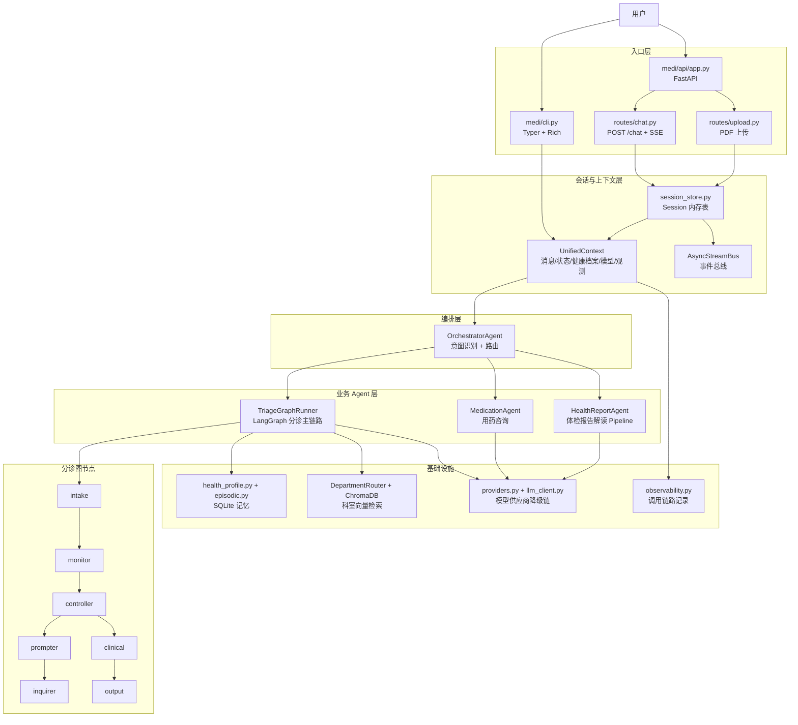
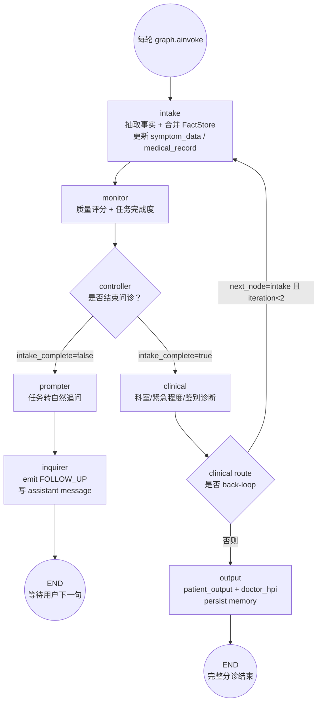
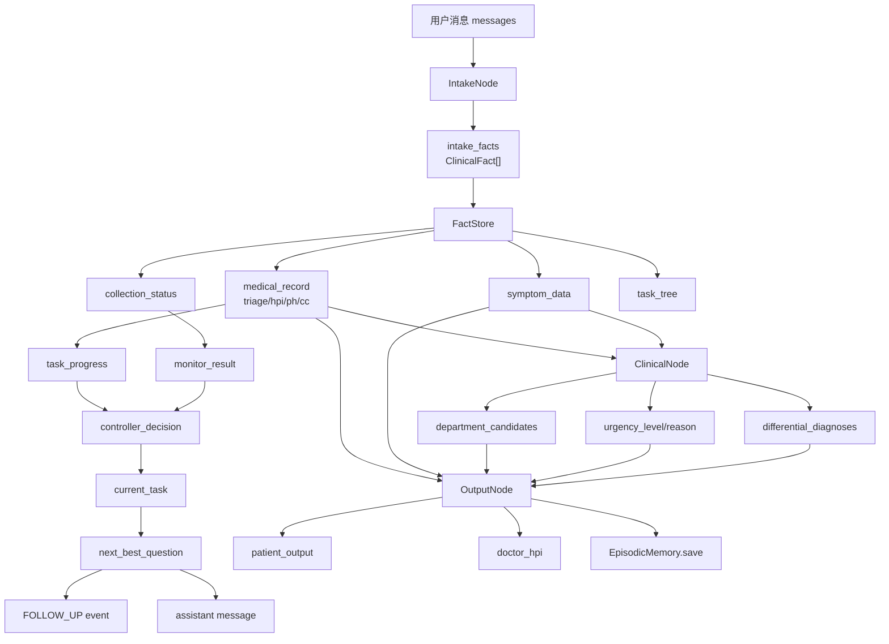
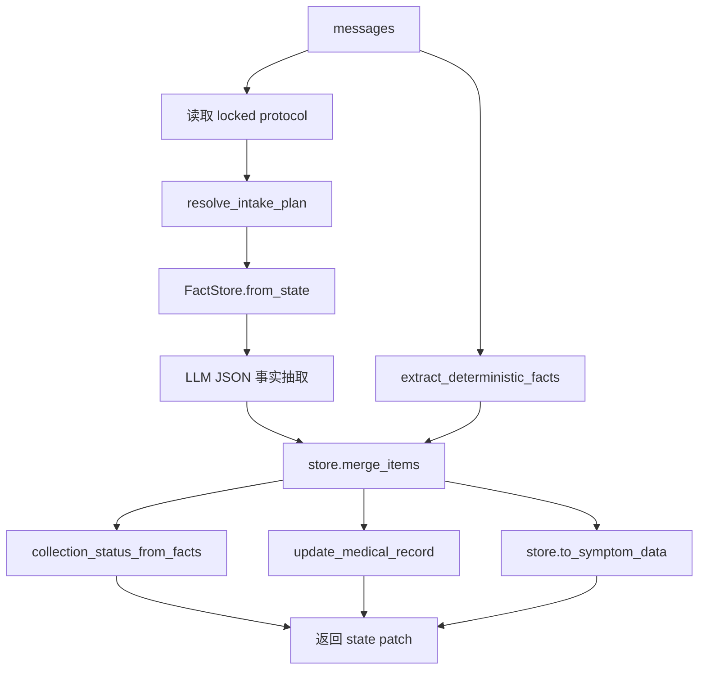
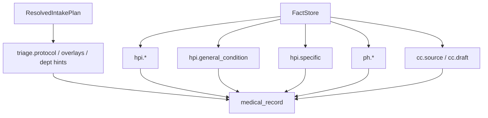
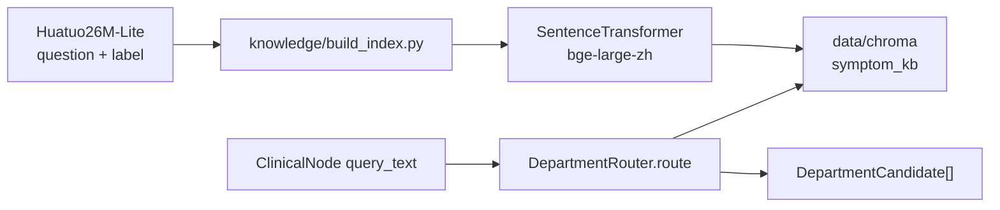
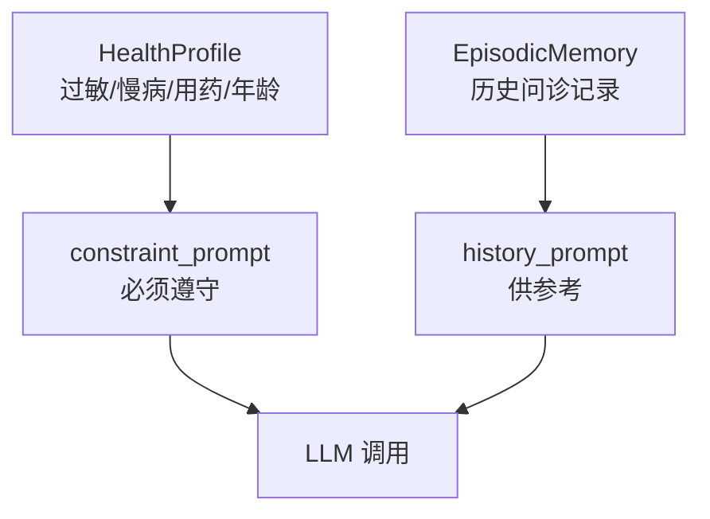
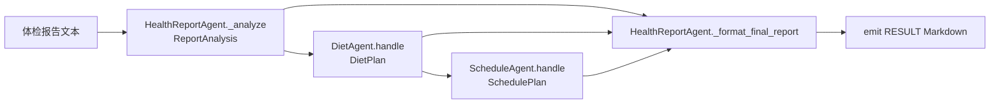
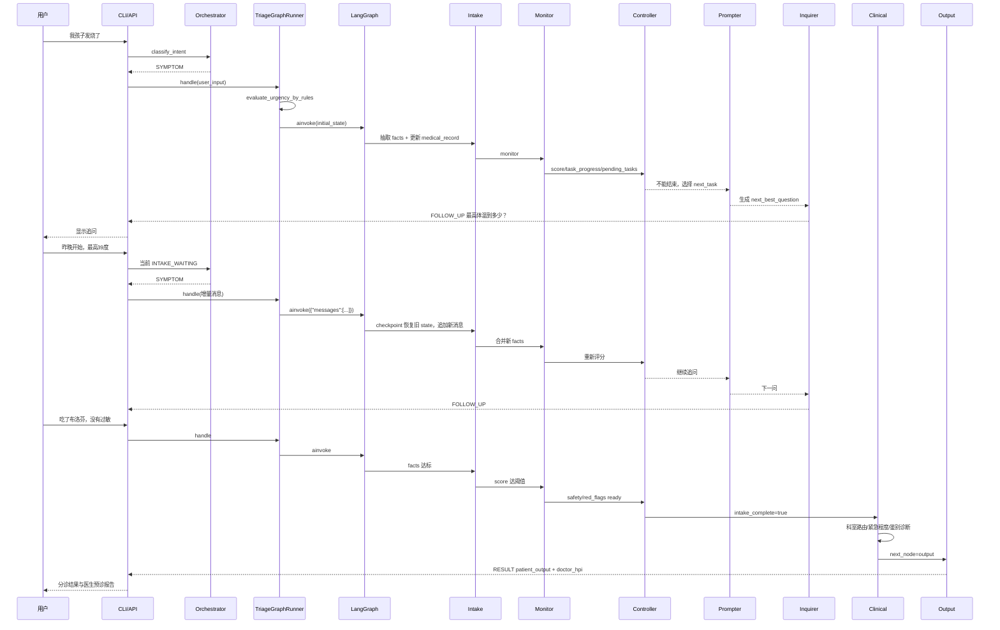
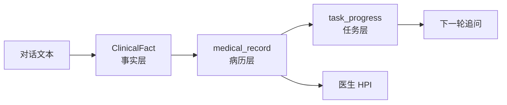

# Medi 项目源码深度解读报告

> 版本说明：本文基于当前工作区源码快照生成，重点解读 `medi/`、`tests/`、`DESIGN.md` 以及 `docs/triage_*` 相关文档。  
> 目标读者：希望深入理解项目整体架构、核心流程、数据流转、类/方法调用关系，并能面试讲清楚该项目的开发者。  
> 阅读建议：先看第 0 章和第 2 章建立全局地图，再从第 7 章开始逐节点读分诊主链路。

---

## 0. 生成规划与阅读路线

这份报告按“先全局、再入口、再主流程、再支撑系统、最后测试和改进点”的顺序组织。

### 0.1 报告生成规划

1. 先确认项目定位、依赖和目录结构。
2. 抽取所有 Python 文件的类、函数、导入关系和核心调用关系。
3. 重点深读分诊主链路：`Runner -> LangGraph -> Intake/Monitor/Controller/Prompter/Inquirer/Clinical/Output`。
4. 补读 API、CLI、Session、Memory、LLM Provider、Observability、ToolRuntime 等基础设施。
5. 补读体检报告多 Agent Pipeline 与用药咨询 Agent。
6. 对照测试用例确认真实边界行为。
7. 输出 Markdown 报告，并用 Mermaid 图表示核心流程和调用结构。

### 0.2 建议阅读顺序

如果你是第一次看这个项目，不建议按目录树从上到下读。更推荐按数据流读：

1. `medi/cli.py` 或 `medi/api/routes/chat.py`：用户请求怎么进系统。
2. `medi/api/session_store.py`：一个 session 里到底有哪些对象。
3. `medi/agents/orchestrator.py`：用户意图怎么被路由。
4. `medi/agents/triage/runner.py`：分诊图每轮怎么启动、恢复、结束。
5. `medi/agents/triage/graph/state.py`：LangGraph 状态结构。
6. `medi/agents/triage/graph/builder.py`：节点拓扑。
7. `intake_node.py -> intake_facts.py -> intake_rules.py -> intake_protocols.py`：事实如何进入系统。
8. `medical_record.py -> task_progress.py -> intake_monitor_node.py -> intake_controller_node.py`：如何判断还缺什么、下一轮问什么。
9. `intake_prompter_node.py -> intake_inquirer_node.py`：任务如何变成用户看到的问题。
10. `clinical_node.py -> department_router.py -> urgency_evaluator.py -> output_node.py`：最终分诊建议和医生 HPI 如何生成。

---

## 1. 项目定位与技术栈

### 1.1 项目定位

Medi 是一个面向中文用户的智能健康 Agent 系统。当前代码已经不只是一个简单的“症状输入 -> LLM 回答”应用，而是一个具有以下特征的多 Agent 医疗预问诊系统：

- 有统一入口：CLI 与 FastAPI。
- 有会话管理：`SessionStore + UnifiedContext`。
- 有意图路由：`OrchestratorAgent`。
- 有分诊主流程：`TriageGraphRunner + LangGraph`。
- 有医疗事实层：`FactStore`。
- 有结构化病历层：`medical_record`。
- 有任务调度层：`task_definitions / task_progress / monitor / controller`。
- 有临床推理层：科室路由、紧急程度、鉴别诊断。
- 有双向输出：患者版建议 + 医生版 HPI。
- 有长期记忆：健康档案与历史问诊记录。
- 有辅助 Agent：用药咨询、体检报告解读、膳食建议、健康日程。
- 有可观测性：LLM 调用、工具调用、阶段耗时的数据结构和查询接口。

### 1.2 技术栈

项目依赖主要来自 `pyproject.toml`：

| 分类 | 依赖 | 在代码中的作用 |
|---|---|---|
| LLM 调用 | `openai` 风格客户端代码，`anthropic` 依赖声明 | `medi/core/providers.py` 目前实际使用 `openai.AsyncOpenAI` 兼容 OpenAI、Qwen、Ollama |
| Agent 编排 | `langgraph` | 分诊主流程的状态图 |
| 向量检索 | `chromadb`, `sentence-transformers` | 症状到科室的向量检索 |
| API | `fastapi`, `uvicorn`, `python-multipart` | HTTP、SSE、文件上传 |
| CLI | `typer`, `rich` | 终端交互与报告展示 |
| 数据库 | `aiosqlite` | 健康档案、就诊记录、观测数据 |
| PDF | `pypdf` | 体检报告 PDF 文本提取 |
| 配置 | `python-dotenv`, `pydantic` | 环境变量与接口 schema |

有两个依赖一致性细节值得注意：

- `medi/core/providers.py` 直接导入 `openai.AsyncOpenAI`，但 `pyproject.toml` 当前没有显式列出 `openai`。
- `medi/knowledge/build_index.py` 使用 `datasets.load_dataset`，但 `pyproject.toml` 当前没有显式列出 `datasets`。

这不影响理解源码，但影响从零安装时的可运行性。

---

## 2. 顶层架构总览

### 2.1 逻辑分层图



### 2.2 一句话概括当前架构

当前项目的核心不是“LLM 一次性问诊”，而是“一个可恢复、可评分、可追问、可安全拦截、能生成医生 HPI 的医疗预问诊状态机”。LLM 被限制在抽取、表达、鉴别诊断和最终生成等位置；协议匹配、事实合并、任务完成度和安全信息覆盖则尽量通过确定性代码控制。

---

## 3. 目录与文件职责地图

### 3.1 顶层目录

| 路径 | 作用 |
|---|---|
| `medi/` | 主应用包 |
| `medi/agents/` | Orchestrator 与各业务 Agent |
| `medi/agents/triage/` | 分诊核心业务 |
| `medi/core/` | 上下文、模型、事件、工具、观测基础设施 |
| `medi/api/` | FastAPI 应用与路由 |
| `medi/memory/` | 健康档案和历史问诊记录 |
| `medi/knowledge/` | 离线构建症状-科室向量索引 |
| `tests/` | 当前设计行为的单元测试 |
| `docs/` | 设计文档、阶段复盘、流程走读 |
| `data/` | SQLite 数据库与 ChromaDB 持久化数据 |

### 3.2 核心文件快速索引

| 文件 | 核心职责 | 主要被谁调用 |
|---|---|---|
| `medi/cli.py` | CLI 对话、observe 查询、API server 启动 | 用户命令 `medi` |
| `medi/api/routes/chat.py` | JSON/SSE 对话接口 | FastAPI |
| `medi/api/session_store.py` | 创建和复用 session、agent、context、bus | API 路由 |
| `medi/agents/orchestrator.py` | 意图分类与业务 Agent 路由 | CLI/API 每轮对话 |
| `medi/agents/triage/runner.py` | 分诊图外层执行器、安全门、checkpoint | Orchestrator |
| `medi/agents/triage/graph/builder.py` | LangGraph 节点拓扑 | Runner |
| `medi/agents/triage/graph/state.py` | 跨节点状态结构 | LangGraph 与所有节点 |
| `intake_node.py` | 临床事实抽取、合并、病历投影 | LangGraph |
| `intake_facts.py` | `ClinicalFact`、`FactStore`、槽位定义 | Intake/Monitor/Clinical/Output |
| `intake_protocols.py` | 主诉协议、overlay、人群风险规则 | Intake/Monitor/Prompter |
| `intake_rules.py` | 药名、过敏、短否认、暴露时间线确定性抽取 | Intake |
| `medical_record.py` | FactStore -> CC/HPI/PH/Triage 病历草稿 | Intake |
| `task_definitions.py` | T1/T2/T3/T4 预问诊任务定义 | Monitor/Controller |
| `task_progress.py` | 基于 medical_record 计算任务完成度 | Monitor |
| `intake_monitor_node.py` | 质量评分、缺失项、任务树、任务进度 | LangGraph |
| `intake_controller_node.py` | 判断能否结束、选择下一任务 | LangGraph |
| `intake_prompter_node.py` | 把任务转成一句追问 | LangGraph |
| `intake_inquirer_node.py` | 发出 FOLLOW_UP 事件，记录任务轮数 | LangGraph |
| `clinical_node.py` | 科室路由、紧急程度、风险因子、鉴别诊断 | LangGraph |
| `output_node.py` | 生成患者建议和医生 HPI，写入历史记忆 | LangGraph |
| `department_router.py` | ChromaDB 向量检索科室 | ClinicalNode |
| `urgency_evaluator.py` | 规则层急症拦截 + LLM 普通分级 | Runner/ClinicalNode |
| `health_profile.py` | 用户健康档案 SQLite | Session/Context/Memory |
| `episodic.py` | 历史分诊记录读写与 prompt 构造 | Runner/Output/CLI |

---

## 4. 一次完整请求如何进入系统

项目有两套主要入口：CLI 和 API。两者最终都会走同一套业务对象：`UnifiedContext`、`AsyncStreamBus`、`OrchestratorAgent`、`TriageGraphRunner` 等。

### 4.1 CLI 入口数据流

入口函数：

- `medi/cli.py:chat()`
- `medi/cli.py:_chat_loop()`
- `medi/cli.py:handle_turn()`

CLI 初始化流程：

1. 加载 `.env`。
2. 生成短 session id。
3. 调用 `load_profile(user_id)` 加载健康档案。
4. 如果非 guest 且档案不完整，通过 `_collect_profile()` 引导用户录入年龄、性别、过敏史、慢性病、当前用药。
5. 创建 `ObservabilityStore`。
6. 创建 `UnifiedContext`，其中包含：
   - `user_id`
   - `session_id`
   - `ModelConfig`
   - `enabled_tools`
   - `health_profile`
   - `observability`
   - `messages`
7. 创建 `DepartmentRouter`。
8. 创建 `AsyncStreamBus`。
9. 创建 `OrchestratorAgent`、`TriageGraphRunner`、`MedicationAgent`、`HealthReportAgent`。

*每次用户发送一条新消息，CLI/API 都会创建一个新的* *AsyncStreamBus* *作为本次请求的事件通道，并把它重新绑定到当前 session 中已有的各个 Agent 上；Agent 和 LangGraph checkpoint 会继续复用，因此问诊状态不会因为 bus 重建而丢失。*

1. 重新创建一个新的 `AsyncStreamBus`。
2. 把新 bus 绑定到所有 Agent 的私有 `_bus` 字段。
3. 并发启动 `consume()` 与 `produce()`。
4. `produce()` 先调用 `triage_agent.symptom_summary()` 拿当前分诊摘要。
5. 调用 `orchestrator.classify_intent(user_input, symptom_summary)`。
6. 根据意图选择：
   - `OUT_OF_SCOPE` -> `orchestrator.handle_out_of_scope()`
   - `FOLLOWUP` -> `orchestrator.handle_followup()`
   - `NEW_SYMPTOM` -> 清空 `ctx.messages`，重置图状态，再走 `triage_agent.handle()`
   - `MEDICATION` -> `MedicationAgent.handle()`
   - `HEALTH_REPORT` -> `HealthReportAgent.handle()`
   - 默认症状 -> `TriageGraphRunner.handle()`
7. `consume()` 监听 bus 事件：
   - `FOLLOW_UP` 打印护士追问。
   - `RESULT` 打印患者分诊结果、医生 HPI 或普通 Markdown。
   - `ESCALATION` 打印红旗警告。
8. 本轮结束后 `obs.flush()` 写入观测数据。


为什么要每轮新建bus？因为这个项目里 AsyncStreamBus 不是“会话状态”，而是**本次用户请求/输入的临时事件通道**。

每轮新建 bus 主要有几个目的：

1. **隔离本轮事件**

用户输入一次，就会产生一批事件，比如：

- STAGE_START
- FOLLOW_UP
- RESULT
- ERROR

这些事件只应该被当前这次 CLI/API 请求消费。新建 bus 可以保证这一轮的事件不会混到上一轮或下一轮里。

1. **方便结束当前响应**

在 API 里，produce() 执行完 Agent 后会：

```
await bus.close() 
```

bus.close() 会给当前消费者队列发 None，让 consume() 停止等待。

也就是说，bus 的生命周期和“一次请求”绑定：

```
用户发一条消息  -> 创建 bus  -> Agent 往 bus 里 emit 事件  -> API/CLI 从 bus 消费事件  -> Agent 处理完  -> close bus  -> 本轮结束 
```

1. **避免旧消费者误收新事件**

尤其是 SSE 场景：

```
GET /chat/stream?message=... 
```

这个请求会一直监听 bus。假如复用同一个 bus，而旧 SSE 连接因为网络问题没有完全清理，就可能出现旧消费者还挂着，下一轮事件被旧连接也收到。

每轮新建 bus，可以让事件通道天然和请求绑定，旧请求结束后就没有资格收到新请求事件。

1. **Agent 是长生命周期，bus 是短生命周期**

在 API 里，Session 会复用这些对象：

- UnifiedContext
- TriageGraphRunner
- OrchestratorAgent
- MedicationAgent
- HealthReportAgent

这些对象要跨轮保留状态或上下文。

但 bus 不需要跨轮保留。它只负责“把本轮产生的事件送出去”。

所以代码才会这样：

```
bus = AsyncStreamBus() rebind_bus(session, bus) 
```

意思是：

> session 和 agent 继续用旧的，但事件通道换成本轮新的。

1. **真正的跨轮状态不在 bus 里**

问诊状态靠这些东西保存：

- ctx.messages
- TriageGraphRunner._checkpointer
- MemorySaver
- TriageGraphState
- intake_facts
- medical_record
- task_progress

bus 里没有保存这些东西。

所以每轮重建 bus 不会导致问诊丢状态。

更准确地说：

> 每轮创建新的 AsyncStreamBus，是为了给当前用户输入创建一个干净、独立、可关闭的事件通道；跨轮对话状态由 UnifiedContext 和 LangGraph checkpoint 保存，而不是由 bus 保存。

### 4.2 API JSON 入口数据流

入口文件：`medi/api/routes/chat.py`

POST `/chat` 调用链：

```text
chat(req)
  -> _run_turn(req.session_id, req.user_id, req.message)
       -> get_or_create_session()
       -> rebind_bus()
       -> asyncio.gather(consume(), produce())
       -> session.obs.flush()
  -> [ChatResponse(**event)]
```

`_run_turn()` 做了两件并发的事：

- `consume()`：从 `AsyncStreamBus.stream()` 收集事件，转换成 API 响应 dict。
- `produce()`：执行 Orchestrator 路由和对应 Agent。

事件转换规则：

| StreamEvent | API event_type | content | metadata |
|---|---|---|---|
| `FOLLOW_UP` | `follow_up` | `event.data["question"]` | 空 |
| `RESULT` | `result` | `event.data["content"]` | 透传 `patient_output` / `doctor_hpi` |
| `ESCALATION` | `escalation` | `event.data["reason"]` | 空 |
| `ERROR` | `error` | `event.data["message"]` | 空 |

### 4.3 API SSE 入口数据流

GET `/chat/stream` 使用 `StreamingResponse` 返回 SSE：

1. `event_generator()` 创建或恢复 session。
2. 创建新 bus 并 rebind。
3. 启动 `produce_task`。
4. `async for event in bus.stream()` 持续消费事件。
5. 每条事件被序列化为：

```text
data: {"event_type":"follow_up","content":"...","session_id":"...","metadata":{}}

```

最后发送：

```json
{"event_type": "done", "content": "", "session_id": "...", "metadata": {}}
```

SSE 与 POST `/chat` 的区别是返回方式不同，核心业务路径完全一致。

### 4.4 PDF 上传入口数据流

入口文件：`medi/api/routes/upload.py`

POST `/upload/report` 的流程：

1. 校验上传文件类型是否为 PDF。
2. 读取 bytes。
3. 使用 `pypdf.PdfReader` 提取每页文字。
4. 若文字少于 `_MIN_TEXT_LENGTH = 50`，返回 422，提示可能是扫描件。
5. 构造输入：

```text
以下是我的体检报告内容：

{pdf text}
```

6. 获取 session、重绑 bus。
7. 直接调用 `session.health_report_agent.handle(user_input)`。
8. 收集 `RESULT` / `ERROR` 事件并返回 `ChatResponse` 列表。

这个入口绕过了 Orchestrator，因为上传场景已经明确是体检报告解读。

---

## 5. Session、Context 与 Bus

### 5.1 Session 对象包含什么

`medi/api/session_store.py` 中定义：

```python
@dataclass
class Session:
    session_id: str
    ctx: UnifiedContext
    agent: TriageGraphRunner
    orchestrator: OrchestratorAgent
    medication_agent: MedicationAgent
    health_report_agent: HealthReportAgent
    obs: ObservabilityStore
```

全局 `_sessions: dict[str, Session]` 是进程内内存表。也就是说：

- 服务重启后 session 丢失。
- 同一进程内，传入相同 `session_id` 可继续会话。
- 长期健康档案和历史问诊记录不在 `_sessions` 中，而是在 SQLite。

### 5.2 get_or_create_session

`get_or_create_session(session_id, user_id)` 负责：

1. 如果 `session_id` 存在且在 `_sessions` 中，直接返回旧 session。
2. 否则生成或使用传入的 session id。
3. 调用 `load_profile(user_id)` 从 SQLite 加载健康档案。
4. 创建 `ObservabilityStore`。
5. 创建 `UnifiedContext`。
6. 创建一个占位 `AsyncStreamBus`。
7. 创建所有 Agent。
8. 缓存到 `_sessions`。

这里有一个设计取舍：`DepartmentRouter` 是模块级 `_router = DepartmentRouter()`，多个 session 共用一个 router。这样可以复用懒加载后的 embedding 模型和 Chroma collection，避免每个 session 都加载一次大模型。

### 5.3 rebind_bus

每轮 API 请求都会新建一个 bus，然后调用：

```python
rebind_bus(session, bus)
```

它会把同一个新 bus 写进：

- `session.agent._bus`
- `session.orchestrator._bus`
- `session.medication_agent._bus`
- `session.health_report_agent._bus`
- `session.health_report_agent._diet_agent._bus`
- `session.health_report_agent._schedule_agent._bus`

这样每一轮请求的事件都只进入本轮 consumer，不会混到上一轮已经关闭的 bus。代价是直接写私有字段，后续如果要更工程化，可以给 Agent 增加统一的 `bind_bus()` 方法。

### 5.4 UnifiedContext 的作用

文件：`medi/core/context.py`

`UnifiedContext` 是所有 Agent 共享的运行时上下文：

| 字段 | 含义 |
|---|---|
| `user_id` | 用户标识 |
| `session_id` | 会话标识 |
| `dialogue_state` | 当前全局对话状态 |
| `health_profile` | 健康档案，作为硬约束 |
| `model_config` | fast/smart 模型供应商链 |
| `enabled_tools` | 当前 session 允许调用的工具名 |
| `observability` | 观测数据缓冲 |
| `messages` | 会话内完整对话历史 |

关键方法：

- `add_user_message(content)`：把用户消息追加到 `ctx.messages`。
- `add_assistant_message(content)`：把助手消息追加到 `ctx.messages`。
- `transition(new_state)`：更新全局对话状态。
- `has_tool(tool_name)`：工具权限检查。
- `build_constraint_prompt()`：把健康档案转换成 LLM system prompt 硬约束。

健康档案 prompt 的语义非常重要：它不是“历史参考”，而是“必须遵守”。例如过敏史、慢性病、当前用药会直接影响用药咨询、风险评估和最终建议。

### 5.5 AsyncStreamBus

文件：`medi/core/stream_bus.py`

`AsyncStreamBus` 是一个简单的异步发布订阅总线：

- `stream()`：调用时创建一个新的队列，并返回异步迭代器。
- `emit(event)`：把事件投递到所有已注册消费者队列。
- `close()`：给所有队列投递 `None`，结束消费。

事件类型包括：

| EventType | 用途 |
|---|---|
| `STAGE_START` / `STAGE_END` | 阶段开始/结束 |
| `FOLLOW_UP` | 分诊护士追问 |
| `ESCALATION` | 红旗症状升级 |
| `RESULT` | 最终或阶段性结果 |
| `ERROR` | 错误或降级提示 |
| `TOOL_CALL` / `TOOL_RESULT` | 工具调用事件 |

当前 API/CLI 主要消费 `FOLLOW_UP`、`RESULT`、`ESCALATION`、`ERROR`。`STAGE_START` 更多用于内部观测或未来前端展示。

---

## 6. OrchestratorAgent：意图识别与业务路由

文件：`medi/agents/orchestrator.py`

### 6.1 Intent 枚举

系统定义了 6 类意图：

| Intent | 场景 |
|---|---|
| `SYMPTOM` | 当前分诊过程中的症状补充 |
| `NEW_SYMPTOM` | 新主诉，需重置分诊图 |
| `MEDICATION` | 药物用途、副作用、冲突咨询 |
| `FOLLOWUP` | 追问上一条分诊建议或普通问候 |
| `HEALTH_REPORT` | 体检报告解读 |
| `OUT_OF_SCOPE` | 医院推荐、挂号、天气等超范围问题 |

### 6.2 classify_intent 的短路逻辑

如果当前 `ctx.dialogue_state` 在以下状态：

- `COLLECTING`
- `GRAPH_RUNNING`
- `INTAKE_WAITING`

则 `classify_intent()` 直接返回 `Intent.SYMPTOM`。

这非常关键。分诊护士问完问题后，用户可能回答“39度”“没有”“不清楚”“？？”，这些短文本如果单独给 LLM 分类，很容易被误判为 out_of_scope 或 followup。这个短路逻辑保证问诊进行中时，用户下一句被当作病史补充处理。

对应测试：

- `tests/test_orchestrator_intake_state.py`

### 6.3 LLM 分类逻辑

非分诊活跃状态下，`classify_intent()` 构造一个 system prompt，注入：

1. 当前对话状态。
2. 意图类别说明。
3. 当前已收集的症状摘要。
4. 最近 10 条对话历史。
5. 用户最新输入。

然后调用：

```python
call_with_fallback(
    chain=self._ctx.model_config.fast_chain,
    call_type="intent_classify",
    max_tokens=15,
    temperature=0,
)
```

如果 LLM 输出无法匹配任何 Intent，默认返回 `Intent.SYMPTOM`，这是一个“宁可继续医疗问诊，不轻易拒绝用户”的设计。

### 6.4 handle_followup

用于回答用户对既有分诊内容的追问：

1. 如果 `ctx.messages` 为空，返回欢迎语。
2. 否则把用户输入加入 `ctx.messages`。
3. 用 fast_chain 基于完整 `ctx.messages` 生成简短回答。
4. 把助手回答加入 `ctx.messages`。
5. emit `RESULT`。

### 6.5 handle_out_of_scope

直接 emit 一段边界提示，不调用 LLM。

---

## 7. 分诊主链路总览

### 7.1 LangGraph 真实拓扑

文件：`medi/agents/triage/graph/builder.py`



### 7.2 两种 END 的含义

LangGraph 的 `END` 只代表“本次图执行结束”，不一定代表整个问诊结束。

| 出口 | 意义 | 外层状态 |
|---|---|---|
| `inquirer -> END` | 本轮追问已发出，等待用户回答 | `DialogueState.INTAKE_WAITING` |
| `output -> END` | 患者建议和医生报告已生成 | `DialogueState.INIT`，Runner 重置图 |

### 7.3 核心数据流图



---

## 8. TriageGraphState 深解

文件：`medi/agents/triage/graph/state.py`

### 8.1 状态字段分组

`TriageGraphState` 是 LangGraph 的核心状态容器，所有跨节点数据都通过它传递。

| 分组 | 字段 | 说明 |
|---|---|---|
| Identity | `session_id`, `user_id` | 会话与用户标识 |
| Conversation | `messages` | 对话历史，使用 `operator.add` 追加 |
| Intake | `symptom_data`, `collection_status`, `intake_protocol_id`, `intake_overlays`, `intake_facts`, `requested_slots` | 预诊护士层数据 |
| Quality/Task | `monitor_result`, `controller_decision`, `intake_review`, `task_tree`, `medical_record`, `task_progress`, `pending_tasks`, `current_task`, `task_rounds`, `triage_done`, `intake_complete` | 质量门与任务调度 |
| Clinical | `department_candidates`, `urgency_level`, `urgency_reason`, `differential_diagnoses`, `risk_factors_summary`, `clinical_missing_slots` | 临床推理结果 |
| Output | `patient_output`, `doctor_hpi` | 最终双输出 |
| Routing | `next_node` | 节点路由信号 |
| Meta | `graph_iteration`, `error` | 循环保护与错误 |

### 8.2 reducer 字段

两个字段带 `operator.add`：

```python
messages: Annotated[list[dict], operator.add]
requested_slots: Annotated[list[str], operator.add]
```

实际效果：

- 后续轮传入 `{"messages": [{"role": "user", "content": "..."}]}` 时，不会覆盖旧消息，而是追加。
- Inquirer 返回 `{"messages": [{"role": "assistant", "content": question}]}` 时，也会追加到图状态。
- `requested_slots` 用于旧槽位追问去重；当前新任务系统主要用 `task_rounds` 记录任务追问次数。

### 8.3 empty helpers

`empty_symptom_data()` 初始化 OPQRST 与扩展症状字段。  
`empty_collection_status()` 初始化护士采集状态。  
`empty_medical_record()` 初始化 `triage/hpi/ph/cc` 四段式病历草稿。

这些 helper 在 `TriageGraphRunner.handle()` 第一轮构造 initial_state 时使用。

---

## 9. TriageGraphRunner：图外层执行器

文件：`medi/agents/triage/runner.py`

### 9.1 Runner 的职责

`TriageGraphRunner` 不负责具体医学逻辑，它负责：

1. 每轮接收用户输入。
2. 前置红旗症状规则扫描。
3. 把用户输入写入 `UnifiedContext.messages`。
4. 构建历史记忆 prompt。
5. 构建 LangGraph。
6. 第一轮传完整 `initial_state`，后续轮只传增量消息。
7. 使用 `MemorySaver` 按 `session_id` 恢复图状态。
8. 根据图返回结果更新全局 `DialogueState`。
9. 完成后重置图状态。

### 9.2 安全门：规则层急症拦截

`handle()` 第一件事是：

```python
urgency = evaluate_urgency_by_rules(user_input)
if urgency and urgency.level == UrgencyLevel.EMERGENCY:
    ...
    self.reset_graph_state()
    return
```

命中红旗关键词时：

1. `ctx.transition(DialogueState.ESCALATING)`
2. emit `ESCALATION`，内容是触发原因。
3. emit `RESULT`，内容是 `EMERGENCY_RESPONSE`。
4. `ctx.transition(DialogueState.INIT)`
5. `reset_graph_state()`
6. 不进入 LangGraph。

这体现了医疗场景中一个重要原则：高危急症不能等待 LLM 判断。

### 9.3 第一轮 initial_state

第一轮 `_is_first_turn=True` 时，Runner 构造完整 `TriageGraphState`。几个关键初值：

| 字段 | 初值 | 意义 |
|---|---|---|
| `messages` | 当前用户输入 | 图内对话历史起点 |
| `symptom_data` | `empty_symptom_data()` | 尚未提取结构化症状 |
| `collection_status` | `empty_collection_status()` | 尚未采集 |
| `intake_protocol_id` | `generic_opqrst` | 初始占位，IntakeNode 会识别真实协议 |
| `intake_facts` | `[]` | 尚无临床事实 |
| `medical_record` | `empty_medical_record()` | 空病历草稿 |
| `task_progress` | `initial_task_progress()` | 所有预问诊任务 pending |
| `pending_tasks` | `task_ids()` | 15 个任务全部待完成 |
| `intake_complete` | `False` | 还不能进入临床推理 |
| `graph_iteration` | `0` | back-loop 保护 |

### 9.4 后续轮增量输入

后续轮只传：

```python
input_data = {"messages": [{"role": "user", "content": user_input}]}
```

由于 `messages` 是 reducer 字段，LangGraph checkpointer 会恢复旧 state，再把这条新消息 append 到旧 messages。

### 9.5 _process_result

图返回后，Runner 做三件事：

1. 如果有 `symptom_data`，缓存到 `_cached_symptom_data`，供 Orchestrator 下一轮意图分类使用。
2. 如果 `patient_output` 不为空，说明 OutputNode 已完成最终输出：
   - `ctx.transition(DialogueState.INIT)`
   - `reset_graph_state()`
3. 如果 `next_node == "intake_wait"`，说明 Inquirer 发了追问：
   - `ctx.transition(DialogueState.INTAKE_WAITING)`
   - 从图 messages 中找最后一条 assistant 消息，同步到 `ctx.messages`。

这里要注意：图内 `messages` 和 `ctx.messages` 不是同一个对象。图内 messages 由 LangGraph checkpoint 管理；`ctx.messages` 给 Orchestrator、followup、辅助 Agent 使用。Runner 在追问后把护士问题同步回 `ctx.messages`，是为了让下一轮意图分类器看到完整上下文。

---

## 10. Builder：图拓扑与依赖注入

文件：`medi/agents/triage/graph/builder.py`

`build_triage_graph()` 接收外部依赖：

- `bus`
- `router`
- `smart_chain`
- `fast_chain`
- `health_profile`
- `constraint_prompt`
- `history_prompt`
- `episodic`
- `session_id`
- `obs`

然后用 `functools.partial` 把这些依赖绑定到节点函数。

### 10.1 节点依赖表

| 节点 | 依赖 | 原因 |
|---|---|---|
| `intake` | `bus`, `fast_chain`, `health_profile`, `obs` | 事实抽取用 fast LLM，协议 overlay 用健康档案 |
| `monitor` | `bus`, `health_profile` | 质量评估、协议解析 |
| `controller` | `bus`, `health_profile` | 调度任务、判断结束 |
| `prompter` | `bus`, `fast_chain`, `health_profile`, `obs` | 生成追问 |
| `inquirer` | `bus` | 发 FOLLOW_UP |
| `clinical` | `bus`, `router`, `smart_chain`, `fast_chain`, `health_profile`, `constraint_prompt`, `session_id`, `obs` | 科室、紧急程度、鉴别诊断 |
| `output` | `bus`, `smart_chain`, `constraint_prompt`, `history_prompt`, `health_profile`, `episodic`, `session_id`, `obs` | 双输出与历史记忆 |

### 10.2 路由函数

`_route_from_controller(state)`：

- 如果 `state["intake_complete"]` 为 True，路由到 `clinical`。
- 否则路由到 `prompter`。

`_route_from_clinical(state)`：

- 如果 `next_node == "intake"` 且 `graph_iteration < 2`，回到 `intake`。
- 否则进入 `output`。

这意味着 ClinicalNode 最多触发一次临床回追问，避免无限循环。

---

## 11. IntakeNode：用户自然语言如何变成结构化事实

文件：`medi/agents/triage/graph/nodes/intake_node.py`

### 11.1 IntakeNode 输入与输出

输入 state：

- `session_id`
- `messages`
- `intake_protocol_id`
- `intake_facts`
- `medical_record`
- `graph_iteration`

输出 state：

- `symptom_data`
- `collection_status`
- `medical_record`
- `intake_facts`
- `intake_protocol_id`
- `intake_overlays`
- `intake_complete=False`
- `next_node="intake_review"`，虽然 builder 实际是固定边到 monitor
- `graph_iteration += 1`

### 11.2 IntakeNode 内部步骤



### 11.3 协议锁定

`_locked_protocol_id(state)` 的逻辑：

- 如果 `state["intake_protocol_id"]` 存在且不是 `generic_opqrst`，返回这个协议。
- 否则返回 None，允许重新匹配。

这实现了两种行为：

- 第一轮用户说“我不太舒服”，系统用 generic。
- 后续用户补充“其实是头晕”，由于 generic 不锁定，协议可升级为 `dizziness_syncope`。
- 一旦识别出非 generic 协议，例如 `fever`，后续即使用户补充“有点拉稀”，也不会切到腹泻协议。

对应测试：

- `test_non_generic_protocol_can_be_locked_across_turns`
- `test_generic_protocol_can_upgrade_when_user_adds_specific_complaint`

### 11.4 LLM 事实抽取

`_call_fact_extractor()` 调用 fast_chain：

- system prompt：临床事实抽取器，不生成追问、建议或诊断。
- 输入：完整护士-患者对话。
- 输出：JSON：

```json
{
  "facts": [
    {
      "slot": "hpi.onset",
      "status": "present",
      "value": "昨晚开始",
      "evidence": "我从昨晚开始发烧",
      "confidence": 0.9
    }
  ]
}
```

约束非常细，包括：

- 只记录患者明确说过的信息。
- 护士问题不能当事实。
- 否认用 `absent`。
- 药物抽到 `safety.current_medications`。
- 过敏史单独抽到 `safety.allergies`。
- 暴露事件和症状起病时间要分开。
- 一般情况抽到 `gc.*`。
- 既往史抽到 `ph.*`。

### 11.5 确定性规则兜底

LLM 抽取后，IntakeNode 还会调用：

```python
extract_deterministic_facts(messages, protocol_id=intake_plan.protocol_id)
```

这层规则覆盖高价值、不能轻易漏掉的信息：

| 规则 | 输出槽位 | 示例 |
|---|---|---|
| 药名识别 | `safety.current_medications` | “吃了布洛芬” |
| 发热退烧药效果 | `specific.antipyretics` | “布洛芬退了一点” |
| 无用药 | `safety.current_medications` absent | “没吃药” |
| 无过敏 | `safety.allergies` absent | “没有药物过敏” |
| 短否认回答结合护士问题 | 多个槽位 absent | 护士问“做过检查吗”，用户答“没有” |
| 暴露事件 | `hpi.exposure_event` | “上周去菲律宾潜水” |
| 暴露后阴性 | `hpi.exposure_symptoms` absent | “潜水没发现耳朵痛” |
| 今日起病 | `hpi.onset` | “今天耳朵刺痛” |

对应测试覆盖：

- `test_deterministic_rules_extract_ibuprofen_as_current_medication`
- `test_deterministic_rules_extract_no_drug_allergy`
- `test_deterministic_rules_use_question_context_for_short_negative_answers`
- `test_exposure_timeline_keeps_diving_separate_from_symptom_onset`

---

## 12. FactStore：事实内存与合并策略

文件：`medi/agents/triage/intake_facts.py`

### 12.1 ClinicalFact 结构

每条事实包含：

| 字段 | 含义 |
|---|---|
| `slot` | 事实位置，如 `hpi.onset` |
| `status` | `present/absent/partial/unknown/not_applicable` |
| `value` | 患者原话中的关键信息 |
| `evidence` | 证据文本 |
| `confidence` | 置信度 |
| `source_turn` | 来源轮次 |

这比简单字符串摘要强很多，因为它能区分：

- 明确存在：`present`
- 明确否认：`absent`
- 回答不完整：`partial`
- 用户不知道：`unknown`
- 不适用：`not_applicable`
- 尚未采集：没有 fact 或 status missing

### 12.2 is_answered 与 is_collected 的区别

`is_answered(slot)`：

- `present/absent/not_applicable` 为 True。
- `partial` 为 False。
- `unknown` 通常为 False。

`is_collected(slot)`：

- 只要用户对该槽位回应过，`unknown` 也算 collected。
- `partial` 不算 collected。

这个区别用于 ClinicalNode 的 back-loop：如果用户已经说“不知道”，系统不应该因为没答案就反复问同一个问题。

对应测试：

- `test_unknown_fact_is_collected_but_not_answered`
- `test_clinical_missing_for_diagnosis_does_not_repeat_unknown_answer`

### 12.3 合并策略 should_replace

`FactStore.merge_fact()` 的核心由 `should_replace(current, new)` 决定：

1. 如果是暴露事件被误当成 onset，且新 onset 更像真正起病时间，则替换。
2. 如果当前是 unknown/partial/missing，新事实是有效回答，则替换。
3. 如果新置信度比旧置信度高 0.15 以上，则替换。
4. 如果新值不同且新状态是 answered，则替换。

这让系统可以跨轮修正事实。例如：

```text
旧事实：hpi.onset = 上周潜水后
新事实：hpi.onset = 今天耳朵里刺痛
```

系统会识别潜水是暴露事件，不是真正起病时间，从而替换 onset。

### 12.4 FactStore 到 symptom_data

`to_symptom_data(raw_descriptions)` 把事实投影成 ClinicalNode 更容易使用的结构：

| symptom_data 字段 | 来源 slot |
|---|---|
| `onset` | `hpi.onset` |
| `exposure_event` | `hpi.exposure_event` |
| `exposure_symptoms` | `hpi.exposure_symptoms` |
| `provocation` | `hpi.aggravating_alleviating` |
| `quality` | `hpi.character` |
| `region` | `hpi.location` |
| `severity` | `hpi.severity` |
| `max_temperature` | `specific.max_temperature` |
| `frequency` | `specific.frequency` |
| `time_pattern` | `hpi.timing` |
| `radiation` | `hpi.radiation` |
| `accompanying` | `hpi.associated_symptoms` 或 fever specific |
| `medications` | `safety.current_medications` |
| `allergies` | `safety.allergies` |
| `general_condition` | `gc.*` |

ClinicalNode 不直接读所有 facts，而是优先读这个症状摘要结构。

---

## 13. IntakeProtocol 与 Overlay：问诊协议如何选择

文件：`medi/agents/triage/intake_protocols.py`

### 13.1 主协议

当前内置协议包括：

| protocol_id | 主诉 | 特点 |
|---|---|---|
| `chest_pain` | 胸痛/胸闷 | 要求放射痛、活动相关性、心血管风险 |
| `dyspnea` | 呼吸困难 | 关注静息/活动、胸痛/喘鸣、紫绀/血氧 |
| `fever` | 发热 | 关注最高体温、退烧药、伴随症状 |
| `abdominal_pain` | 腹痛 | 关注部位、呕吐腹泻、黑便/血便、进食相关 |
| `headache` | 头痛 | 关注雷击样、神经缺损、发热颈强 |
| `trauma` | 外伤 | 关注机制、负重/功能、出血畸形 |
| `diarrhea_vomiting` | 腹泻/呕吐 | 关注次数、性状、脱水、血便 |
| `rash_allergy` | 皮疹/过敏 | 关注诱因、黏膜/肿胀、呼吸 |
| `dizziness_syncope` | 头晕/晕厥 | 关注意识丧失、神经症状、胸痛心悸 |
| `generic_opqrst` | 通用 | 回退协议 |

### 13.2 overlay

Overlay 是人群或风险叠加规则，避免为“儿童发热”“老人腹痛”“孕妇头痛”组合爆炸地建协议。

当前 overlay：

| overlay_id | 触发方式 | 追加重点 |
|---|---|---|
| `pediatric` | 文本含孩子/宝宝等，或健康档案年龄 < 14 | 年龄、精神状态、饮水/进食/尿量 |
| `elderly` | 文本含老人/高龄等，或年龄 >= 65 | 基础功能、跌倒/意识变化 |
| `pregnancy` | 文本或健康档案提示妊娠/产后 | 孕周、阴道流血/腹痛/胎动 |
| `immunocompromised` | 化疗、免疫抑制、移植、HIV 等 | 免疫抑制状态、感染暴露 |

### 13.3 协议匹配细节

`_conversation_text(messages)` 只拼接 user 消息，不拼接 assistant 消息。这避免护士问题污染协议识别。例如护士问“有没有胸痛”，不会让系统误切换到胸痛协议。

`_keyword_asserted(text, keyword)` 会检查关键词前 6 个字符是否有否定词：

- 没有
- 无
- 不
- 不是
- 未
- 否认

因此“我没有胸痛，就是头晕”不会触发 chest_pain，而会触发 dizziness。

对应测试：

- `test_assistant_questions_do_not_pollute_protocol_matching`
- `test_negated_protocol_keyword_does_not_trigger_match`

---

## 14. medical_record：从 facts 到医生可读病历草稿

文件：`medi/agents/triage/medical_record.py`

### 14.1 病历四段式结构

`medical_record` 包含四个 section：

```python
{
  "triage": {},
  "hpi": {},
  "ph": {},
  "cc": {},
}
```

含义：

| section | 含义 |
|---|---|
| `triage` | 分诊主题、协议、初步科室提示 |
| `hpi` | 现病史 |
| `ph` | 既往史与安全信息 |
| `cc` | 主诉草稿与生成主诉 |

### 14.2 update_medical_record 的数据流



### 14.3 科室 hint

`TRIAGE_DEPARTMENT_HINTS` 根据 protocol_id 给出初步科室：

| protocol | primary | secondary |
|---|---|---|
| `fever` | 内科 | 发热门诊 |
| `headache` | 内科 | 神经内科 |
| `trauma` | 外科 | 创伤外科 |
| `rash_allergy` | 皮肤科 | 过敏反应门诊 |
| `generic_opqrst` | 全科医学科 | 普通门诊 |

这些 hint 会让 `T1_PRIMARY_DEPARTMENT` 与 `T1_SECONDARY_DEPARTMENT` 任务较早达到完成状态，后续 ClinicalNode 的向量路由会给出更正式的候选科室。

### 14.4 generated chief complaint

`_generate_chief_complaint(record)` 使用主诉和持续时间合成简短主诉，例如：

```text
孩子发烧 + 昨晚 -> 孩子发烧昨晚
```

当前实现比较朴素，但它确保 `T4_CHIEF_COMPLAINT_GENERATION` 有结构化来源。

### 14.5 保留未管理字段

`_base_record(current)` 使用 `deepcopy(current)`，并只覆盖自己管理的字段。测试确认它会保留已有的 `manual_note`、`custom_field` 等外部字段。

---

## 15. 任务定义与任务完成度

文件：

- `medi/agents/triage/task_definitions.py`
- `medi/agents/triage/task_progress.py`

### 15.1 任务分组

系统把预问诊拆成 4 组 15 个任务：

| 组 | 含义 | 任务数 |
|---|---|---|
| T1 | Triage，科室/分诊方向 | 2 |
| T2 | HPI，现病史采集 | 6 |
| T3 | Past History，既往史与安全信息 | 6 |
| T4 | Chief Complaint Generation，主诉生成 | 1 |

完成阈值：

```python
TASK_COMPLETION_THRESHOLD = 0.85
```

### 15.2 任务示例

`T2_ONSET` 要求：

- `onset_time`：`hpi.onset` 或 `hpi.timing`
- `onset_location`：`hpi.location`
- `onset_trigger`：`hpi.exposure_event` 或 `hpi.aggravating_alleviating`

它的 score 是完成 requirement 的比例。例如 3 个 requirement 完成 1 个，则 score = 0.33。

`T3_CURRENT_MEDICATIONS` 要求：

- `ph.current_medications`

只要患者明确说“吃了布洛芬”或“没有用药”，该任务就 complete。

### 15.3 evaluate_task_progress

输入：

```python
medical_record: dict
```

输出：

```python
(progress: dict[str, dict], pending_tasks: list[str])
```

它不直接看 raw messages，也不直接看 FactStore，而是看 medical_record 中的语义路径是否已有可用证据。

判断一个路径是否完成：

- dict 中 `status` 属于 `present/absent/not_applicable`，完成。
- dict 中有 `value` 且 value 有效，完成。
- 字符串非空且不是 unknown/none/null，完成。
- list/tuple/set 中任一元素完成，完成。

这让“明确否认”也可以完成任务。例如没有过敏史是有效的安全信息，不应继续追问。

---

## 16. Monitor：质量评分与缺口识别

文件：`medi/agents/triage/graph/nodes/intake_monitor_node.py`

### 16.1 Monitor 的定位

Monitor 只评估，不调度。它输出：

- `monitor_result`
- `task_tree`
- `task_progress`
- `pending_tasks`
- `triage_done`
- 更新后的 `collection_status`
- `next_node="controller"`

它不决定下一轮问什么，也不决定能否结束。这个职责交给 Controller。

### 16.2 评分结构

`_score(store, plan, relaxed_low_value, clinical_missing)` 输出：

```python
(score, missing, red_flags_checked, safety_covered)
```

评分项：

| 信息 | 分值 |
|---|---|
| 主诉 | +12 |
| 起病时间或时间特征 | +14 |
| 严重程度/量化指标 | +12 |
| 部位 | +8，如果协议要求 |
| 症状性质 | +6，如果协议要求 |
| 伴随症状 | +12 |
| pattern 槽完成比例 | 最高 +20 |
| 当前用药 | +7 |
| 过敏史 | +8 |
| 相关既往史 | +8 |

高风险协议阈值是 80，普通协议阈值是 74。

### 16.3 relaxed_low_value

当护士已经问了 5 轮以上：

```python
relaxed_low_value = assistant_count >= 5
```

系统会对部分低价值问题变宽松，例如非高风险场景下不再强制追问疼痛性质或疼痛评分，避免体验过差。

但是用药、过敏、危险信号不能随便放宽。

### 16.4 危险信号覆盖

Monitor 定义了每个协议的 `CRITICAL_PATTERN_KEYS`，例如：

- fever：`max_temperature`, `associated_fever_symptoms`
- chest_pain：`dyspnea_sweating`, `exertional_related`, `cardiovascular_history`
- headache：`sudden_or_worst`, `neuro_deficits`, `fever_neck_stiffness`

Overlay 也有关键槽，例如 pediatric：

- `age`
- `mental_status`
- `intake_urination`

只有这些危险信号槽全部 answered，`red_flags_checked` 才为 True。

### 16.5 doctor_summary_ready

Monitor 不是只看 score。`doctor_summary_ready` 要同时满足：

- 分数达到阈值。
- `red_flags_checked=True`。
- 核心医生摘要字段 ready。

核心医生摘要字段包括：

- 主诉
- 起病时间或时间特征
- 严重程度或量化指标
- 伴随症状

这避免系统因为某些非关键项得分足够就提前结束。

---

## 17. Controller：全局任务调度器

文件：`medi/agents/triage/graph/nodes/intake_controller_node.py`

### 17.1 Controller 的定位

Controller 读取 Monitor 结果和任务完成度，做两个决策：

1. 是否可以结束 intake，进入 ClinicalNode。
2. 如果不能结束，下一轮推进哪个任务。

输出：

- `collection_status`
- `controller_decision`
- `current_task`
- `intake_complete`
- `next_node`

### 17.2 下一任务选择公式

`_task_dispatch_score(item, task_rounds)`：

```python
value = base_priority * max(0.0, 1.0 - score)
if item["critical"]:
    value += CRITICAL_TASK_BONUS
value -= TASK_REPEAT_PENALTY * task_rounds[task_id]
```

其中：

- `CRITICAL_TASK_BONUS = 30`
- `TASK_REPEAT_PENALTY = 18`

含义：

- 优先级越高、完成度越低，越应该问。
- critical 任务额外加分。
- 已经问过多次的任务会被惩罚，避免重复追问。

### 17.3 结束条件

`_decide_finish()` 返回 `(can_finish, reason)`。

可以结束的情况：

1. 达到最大追问轮数 `MAX_INTAKE_ROUNDS = 10`。
2. 没有 blocking pending tasks。
3. 没有可调度任务。
4. 达到 preferred limit 且核心信息有价值：
   - `assistant_count >= preferred_limit`
   - `monitor_score >= 65`
   - `red_flags_checked=True`
   - `safety_slots_covered=True`
   - `doctor_summary_ready=True`
   - 没有 critical pending tasks

preferred limit 是：

```python
preferred_limit = min(max_rounds, PREFERRED_MAX_QUESTIONS)
PREFERRED_MAX_QUESTIONS = 8
```

### 17.4 blocking 与 critical

`_blocking_pending_tasks()` 会忽略 `T4_CHIEF_COMPLAINT_GENERATION`，因为主诉生成不是追问阶段要问用户的任务。

`_critical_pending_tasks()` 用于保证用药和过敏等 critical 任务没有完成时不轻易结束。

对应测试：

- `test_controller_selects_highest_value_pending_task`
- `test_controller_skips_chief_complaint_generation_during_inquiry`
- `test_controller_does_not_use_preferred_exit_when_safety_or_red_flags_missing`

---

## 18. Prompter 与 Inquirer：任务如何变成用户看到的问题

### 18.1 Prompter

文件：`medi/agents/triage/graph/nodes/intake_prompter_node.py`

输入：

- `controller_decision.next_best_task`
- `controller_decision.task_instruction`
- `FactStore`
- `medical_record`
- `task_progress`
- 最近对话记录
- `ResolvedIntakePlan`

输出：

- `controller_decision.next_best_question`
- `next_node="inquirer"`

Prompter 调用 fast_chain，system prompt 限制：

- 只问一个问题。
- 不暴露任务编号或技术字段名。
- 不给诊断、建议或安慰。
- 如果上一轮回答相关但不完整，先承认再追问。

### 18.2 Prompter fallback

如果 LLM 调用失败或无效，Prompter 使用 `_fallback_question()`。

它有两层 fallback：

1. 根据 slot，例如 `hpi.onset` -> “这个症状是什么时候开始的？”
2. 根据 task，例如 `T2_ONSET` -> “这个症状是什么时候开始的？”

这样即使没有 LLM chain，系统仍能继续追问。

对应测试：

- `test_prompter_node_falls_back_without_llm_chain`

### 18.3 Inquirer

文件：`medi/agents/triage/graph/nodes/intake_inquirer_node.py`

Inquirer 是唯一负责用户可见追问副作用的节点。

它做四件事：

1. emit `STAGE_START`。
2. emit `FOLLOW_UP`：

```python
{
  "question": question,
  "round": assistant_count + 1,
  "task": task_id,
}
```

3. 更新 `task_rounds[task_id] += 1`。
4. 返回：

```python
{
  "messages": [{"role": "assistant", "content": question}],
  "task_rounds": task_rounds,
  "intake_complete": False,
  "next_node": "intake_wait",
}
```

由于 builder 中 `inquirer -> END`，本轮图到此结束，控制权回到 CLI/API，等待用户下一句。

---

## 19. ClinicalNode：临床推理与 back-loop

文件：`medi/agents/triage/graph/nodes/clinical_node.py`

### 19.1 ClinicalNode 的职责

ClinicalNode 做五件事：

1. 构建症状摘要和向量检索 query。
2. 调用 `DepartmentRouter.route()` 获取科室候选。
3. 调用 `evaluate_urgency_by_llm()` 做语义层紧急程度评估。
4. 调用 `evaluate_risk_factors()` 结合健康档案提升风险。
5. 调用 LLM 生成鉴别诊断。
6. 判断是否需要临床 back-loop 回 intake。

### 19.2 科室路由

`_build_query_text(symptom_data, messages)` 优先使用结构化字段：

- `region`
- `quality`
- `time_pattern`
- `onset`
- `exposure_event`
- `max_temperature`
- `frequency`
- `accompanying`

如果没有结构化字段，则退回最近 3 条用户消息。

然后：

```python
raw_candidates = await router.route(query_text, top_k=3)
```

候选被转成 `DepartmentResult`：

```python
{
  "department": "...",
  "confidence": 0.76,
  "reason": "..."
}
```

### 19.3 紧急程度评估

Runner 已经做过规则层 emergency 拦截。ClinicalNode 这里调用 LLM 只判断：

- `urgent`
- `normal`
- `watchful`

如果 health_profile 风险因子提示 `elevated_urgency=True`，且当前是 `normal/watchful`，则提升为 `urgent`。

### 19.4 风险因子评估

文件：`medi/agents/triage/tools/clinical_tools.py`

`evaluate_risk_factors(symptom_data, health_profile)` 会交叉分析：

- 心血管症状 + 高血压/冠心病/心律失常/年龄
- 消化症状 + 糖尿病/胃溃疡/肝胆病/NSAIDs
- 神经症状 + 高血压/糖尿病/房颤/脑血管病
- 过敏史

输出：

```python
{
  "risk_factors": [...],
  "risk_summary": "...",
  "elevated_urgency": bool
}
```

### 19.5 鉴别诊断

`_generate_differential()` 调用 smart_chain，要求 JSON：

```json
{
  "differential_diagnoses": [
    {
      "condition": "疑似诊断名称",
      "likelihood": "high|medium|low",
      "reasoning": "推理依据",
      "supporting_symptoms": [],
      "risk_factors": []
    }
  ]
}
```

最多取 4 个。

如果 LLM 或 JSON 解析失败，降级为基于科室候选的“需进一步评估”诊断。

### 19.6 clinical back-loop

ClinicalNode 会计算：

```python
has_high_likelihood = any(d["likelihood"] == "high" for d in differential_diagnoses)
clinical_missing_slots = _missing_for_diagnosis(state, symptom_data)
```

如果：

- 没有 high likelihood 诊断；
- 存在明确可补字段；
- `graph_iteration < 2`；

则 `next_node="intake"`，回去再问一轮。

否则进入 output。

这里的设计很克制：只有“明确知道缺哪个字段”才回问，不因为 LLM 不自信就泛泛地继续问。

---

## 20. DepartmentRouter 与知识库构建

### 20.1 DepartmentRouter

文件：`medi/agents/triage/department_router.py`

核心常量：

```python
CHROMA_PATH = data/chroma
COLLECTION_NAME = "symptom_kb"
EMBED_MODEL = "BAAI/bge-large-zh-v1.5"
BGE_QUERY_PREFIX = "为这个句子生成表示以用于检索相关文章："
```

`DepartmentRouter` 懒加载：

1. 第一次 `route()` 时加载 `SentenceTransformer`。
2. 打开 `chromadb.PersistentClient`。
3. 获取 collection。

`route(query_text, top_k=3)`：

1. 用 bge prefix 编码 query。
2. 检索 `top_k * 5` 条。
3. 将 Chroma 的 cosine distance 转相似度：

```python
similarity = max(0.0, 1.0 - dist / 2.0)
```

4. 按科室聚合，取每个科室最高相似度。
5. 返回 top_k 个 `DepartmentCandidate`。

### 20.2 build_index

文件：`medi/knowledge/build_index.py`

离线构建流程：

1. `load_dataset("FreedomIntelligence/Huatuo26M-Lite")`
2. 取 `question`、`label`、`score`。
3. 根据 `min_score` 过滤。
4. 用 md5 去重。
5. 用 `BAAI/bge-large-zh-v1.5` 生成 embedding。
6. 写入 ChromaDB collection `symptom_kb`。

### 20.3 数据流关系



---

## 21. OutputNode：患者建议与医生 HPI 双输出

文件：`medi/agents/triage/graph/nodes/output_node.py`

### 21.1 OutputNode 的输入

OutputNode 读取：

- `symptom_data`
- `medical_record`
- `intake_facts`
- `department_candidates`
- `urgency_level`
- `urgency_reason`
- `differential_diagnoses`
- `risk_factors_summary`
- `messages`
- `health_profile`
- `constraint_prompt`
- `history_prompt`

### 21.2 为什么一次 LLM 调用生成双输出

OutputNode 的设计是单次 smart_chain 调用，同时要求输出：

- `patient_output`
- `doctor_hpi`

这样能保证：

- 患者版紧急程度和医生版紧急程度一致。
- 患者建议引用的科室与医生报告中的分诊摘要一致。
- 同一批 facts 和 medical_record 被同一上下文消费，减少矛盾。

### 21.3 patient_output schema

患者侧输出包括：

- 首选科室
- 备选科室
- 紧急程度
- 紧急程度理由
- 就医建议
- 需要立即就医的危险信号

### 21.4 doctor_hpi schema

医生侧输出包括：

- 患者元信息
- 主诉
- HPI narrative
- onset/location/duration/character/radiation/timing/severity
- 伴随症状
- 相关阴性
- 检查/诊断经过
- 治疗经过
- 一般情况
- 既往史
- 当前用药
- 过敏史
- 鉴别诊断
- 建议检查
- 分诊摘要
- 记录覆盖情况
- 会话和时间戳

### 21.5 Builder 降级与补齐

OutputNode 有两个 Builder：

- `PatientOutputBuilder`
- `DoctorHpiBuilder`

它们不仅解析 LLM JSON，还会从已有结构化数据补齐字段。

`DoctorHpiBuilder` 的关键设计：

1. 系统侧 `user_id/age/gender/session_id/time` 优先级高于 LLM 输出，防止模型幻觉污染元信息。
2. `medical_record` 优先补齐 HPI 字段。
3. `severity_score` 会修正 “39度/10” 这种错误格式。
4. `hpi_narrative` 会追加 medical_record 中 LLM 漏掉的关键信息。
5. `record_coverage` 自动标出使用了哪些 section，以及仍缺哪些关键项。

对应测试：

- `test_doctor_hpi_builder_uses_system_patient_metadata`
- `test_doctor_hpi_builder_fills_report_from_medical_record`
- `test_doctor_hpi_parser_cleans_temperature_with_nrs_suffix`

### 21.6 EpisodePersistor

最终输出完成后：

```python
await EpisodePersistor(episodic).persist(
    symptom_summary=symptom_summary,
    patient_output=patient_output,
    department_candidates=department_candidates,
)
```

它保存：

- 症状摘要
- 患者建议
- 首选科室

写入 `visit_records` 表，作为下次会话的软参考。

---

## 22. 记忆系统：健康档案与历史问诊

### 22.1 HealthProfile

文件：`medi/memory/health_profile.py`

`HealthProfile` 是硬约束：

| 字段 | 用途 |
|---|---|
| `user_id` | 用户标识 |
| `age` | 风险 overlay、医生报告元信息 |
| `gender` | 医生报告元信息 |
| `chronic_conditions` | 风险因子、prompt 硬约束 |
| `allergies` | 用药建议硬约束 |
| `current_medications` | 药物冲突和风险 |
| `visit_history` | 最近问诊记录 |

SQLite 表：

- `profiles`
- `visit_records`

### 22.2 EpisodicMemory

文件：`medi/memory/episodic.py`

`EpisodicMemory` 是软参考：

- `save()`：保存一次分诊记录。
- `recent()`：读取最近 N 条记录。
- `build_history_prompt()`：构造：

```text
[历史就诊记录（供参考，非硬约束）]
- 2026-05-02 | 儿科 | 发热...
```

Runner 每轮构图前调用：

```python
history_prompt = await self._episodic.build_history_prompt()
```

OutputNode 将其注入最终输出上下文。

### 22.3 硬约束与软参考的区别



这一区分在医疗场景中很重要：过敏史不能只是“参考”，而必须成为强约束。

---

## 23. MedicationAgent：用药咨询

文件：`medi/agents/medication/agent.py`

### 23.1 流程

1. 把用户输入加入 `ctx.messages`。
2. 构造 `MEDICATION_SYSTEM_PROMPT`。
3. 如果有健康档案，追加 `ctx.build_constraint_prompt()`。
4. 调用 smart_chain：

```python
call_type="medication"
max_tokens=600
```

5. 把回答加入 `ctx.messages`。
6. emit `RESULT`。

### 23.2 当前能力边界

当前 MedicationAgent 是单轮 LLM 咨询，尚未接入药品数据库。system prompt 明确禁止：

- 给具体剂量。
- 替代医生/药师诊断。
- 判断用户是否需要用某药。

后续扩展方向在注释中已经写明：

- 接 NMPA/RxNorm/OpenFDA。
- 标准化药物名。
- 多模态 OCR 药盒/说明书。

---

## 24. HealthReportAgent 多 Agent Pipeline

文件：

- `medi/agents/health_report/agent.py`
- `diet_agent.py`
- `schedule_agent.py`
- `schemas.py`

### 24.1 Pipeline 图



### 24.2 结构化数据传递

Agent 之间不传自由文本，而是传 dataclass：

| 类 | 来源 | 去向 |
|---|---|---|
| `ReportAnalysis` | HealthReportAgent._analyze | DietAgent, ScheduleAgent, final report |
| `AbnormalIndicator` | ReportAnalysis 子结构 | DietAgent 生成膳食建议 |
| `DietPlan` | DietAgent | ScheduleAgent, final report |
| `DietSuggestion` | DietPlan 子结构 | final report |
| `SchedulePlan` | ScheduleAgent | final report |

### 24.3 阶段事件

HealthReportAgent 会 emit 多次 `RESULT` 作为进度提示：

1. “正在解读体检报告，请稍候...”
2. “正在制定膳食方案...”
3. “正在规划健康日程...”
4. 最终 Markdown 综合健康方案。

这与分诊图的 `FOLLOW_UP/RESULT` 不同，体检报告是同步 pipeline，不需要多轮用户追问。

---

## 25. LLM Provider 与降级链

文件：

- `medi/core/providers.py`
- `medi/core/llm_client.py`

### 25.1 Provider 抽象

`LLMProvider` 定义统一接口：

```python
async def create(self, messages: list[dict], max_tokens: int, **kwargs)
```

实现：

| Provider | 实际接口 | 说明 |
|---|---|---|
| `OpenAIProvider` | OpenAI 官方 API | 完整透传 tools 等参数 |
| `QwenProvider` | DashScope OpenAI 兼容端点 | 过滤 tools/tool_choice |
| `LocalProvider` | Ollama OpenAI 兼容端点 | 本地兜底，过滤工具参数 |

### 25.2 smart_chain 与 fast_chain

`build_smart_chain()`：

1. 如果有 `OPENAI_API_KEY`，加入 `openai/gpt-4o`。
2. 如果有 `DASHSCOPE_API_KEY`，加入 `qwen/qwen-max`。
3. 总是加入 `local/qwen2.5:7b`。

`build_fast_chain()`：

1. 如果有 `OPENAI_API_KEY`，加入 `openai/gpt-4o-mini`。
2. 如果有 `DASHSCOPE_API_KEY`，加入 `qwen/qwen-turbo`。
3. 总是加入 `local/qwen2.5:7b`。

### 25.3 call_with_fallback

`call_with_fallback()` 逐个 provider 尝试：

1. 记录开始时间。
2. 如果是 fallback provider，emit `ERROR` 事件提示降级。
3. 调用 provider。
4. 成功则记录 `LLMTrace` 并返回 response。
5. 捕获 `RateLimitError`、`APIStatusError`、`APITimeoutError` 时记录失败 trace，尝试下一个 provider。
6. 全部失败则抛出最后一个异常。

记录字段：

- `provider`
- `call_type`
- `is_fallback`
- `prompt_tokens`
- `completion_tokens`
- `latency_ms`
- `success`
- `error_type`

---

## 26. Observability 与 ToolRuntime

### 26.1 ObservabilityStore

文件：`medi/core/observability.py`

三类 trace：

| Trace | 表 | 内容 |
|---|---|---|
| `LLMTrace` | `llm_traces` | provider、token、耗时、是否降级 |
| `ToolTrace` | `tool_traces` | 工具名、耗时、成功/失败 |
| `StageTrace` | `stage_traces` | 阶段名、耗时 |

`flush()` 将内存缓冲写入 `data/observability.db`。

查询接口：

- `query_recent_sessions(limit)`
- `query_session_detail(session_id)`

CLI 命令 `medi observe` 和 API `/observe` 都复用这些查询函数。

### 26.2 ToolRuntime

文件：`medi/core/tool_runtime.py`

ToolRuntime 提供：

- 工具注册。
- 工具权限校验。
- 按优先级设置超时和重试。
- emit `TOOL_CALL` / `TOOL_RESULT`。
- CRITICAL 工具审计日志。
- 写入 `ToolTrace`。

工具优先级：

| Priority | 超时 | 重试 | 失败策略 |
|---|---:|---:|---|
| `CRITICAL` | 10s | 1 | emit ERROR 并抛出 |
| `STANDARD` | 5s | 3 | 重试耗尽后抛出 |
| `OPTIONAL` | 3s | 1 | 返回 None，静默跳过 |

当前主分诊链路中的 `DepartmentRouter` 和 `evaluate_urgency_by_llm` 是直接调用，并没有通过 ToolRuntime。因此 ToolRuntime 更像已经设计好的基础设施，尚未全面接入业务节点。

---

## 27. 端到端分诊序列图

下面以“用户说孩子发烧”为例，展示多轮预问诊的数据流。



---

## 28. 类与方法调用关系总表

### 28.1 入口与会话

| 类/函数 | 调用谁 | 被谁调用 | 数据读写 |
|---|---|---|---|
| `cli.chat()` | `_chat_loop()` | Typer | CLI 参数 |
| `_chat_loop()` | `load_profile`, `save_profile`, Agent 构造 | `cli.chat()` | 创建 ctx/bus/agents |
| `handle_turn()` | `classify_intent`, 各 Agent handle, `obs.flush` | `_chat_loop()` | 每轮 user_input |
| `api.chat()` | `_run_turn()` | FastAPI | ChatRequest -> ChatResponse |
| `api.chat_stream()` | `get_or_create_session`, Orchestrator, Agent | FastAPI | SSE |
| `get_or_create_session()` | `load_profile`, Agent 构造 | API routes | `_sessions` |
| `rebind_bus()` | 写 Agent `_bus` | API routes | 事件通道 |

### 28.2 Orchestrator 与 Agent 路由

| 类/函数 | 调用谁 | 被谁调用 | 数据读写 |
|---|---|---|---|
| `OrchestratorAgent.classify_intent()` | `call_with_fallback` | CLI/API produce | `ctx.dialogue_state`, `ctx.messages` |
| `handle_followup()` | `call_with_fallback`, bus.emit | CLI/API produce | 追加 ctx.messages |
| `handle_out_of_scope()` | bus.emit | CLI/API produce | 无 LLM |
| `MedicationAgent.handle()` | `ctx.build_constraint_prompt`, `call_with_fallback` | Orchestrator route | 追加 ctx.messages |
| `HealthReportAgent.handle()` | `_analyze`, `DietAgent`, `ScheduleAgent` | Orchestrator/upload | 结构化 pipeline |

### 28.3 分诊 Runner 与图

| 类/函数 | 调用谁 | 被谁调用 | 数据读写 |
|---|---|---|---|
| `TriageGraphRunner.handle()` | `evaluate_urgency_by_rules`, `_build_graph`, `graph.ainvoke` | Orchestrator route | `ctx.messages`, checkpoint |
| `_build_graph()` | `build_triage_graph` | `handle()` | 注入 bus/router/model/profile |
| `_process_result()` | `ctx.transition`, `reset_graph_state` | `handle()` | 更新 `_cached_symptom_data` |
| `build_triage_graph()` | LangGraph `StateGraph` | Runner | 节点拓扑 |
| `_route_from_controller()` | 无 | LangGraph | `intake_complete` |
| `_route_from_clinical()` | 无 | LangGraph | `next_node`, `graph_iteration` |

### 28.4 分诊节点

| 节点 | 主要内部函数 | 读 state | 写 state |
|---|---|---|---|
| `intake_node` | `_call_fact_extractor`, `extract_deterministic_facts`, `update_medical_record` | messages, intake_facts, protocol, medical_record | facts, symptom_data, collection_status, medical_record |
| `intake_monitor_node` | `_score`, `build_intake_task_tree`, `evaluate_task_progress` | facts, protocol, medical_record, clinical_missing | monitor_result, task_tree, task_progress, pending_tasks |
| `intake_controller_node` | `_select_next_task`, `_decide_finish` | monitor_result, task_progress, pending_tasks, task_rounds | controller_decision, current_task, intake_complete |
| `intake_prompter_node` | `_llm_generate_question`, `_fallback_question` | current_task, decision, facts, medical_record | next_best_question |
| `intake_inquirer_node` | bus.emit | controller_decision, current_task | assistant message, task_rounds, next_node |
| `clinical_node` | router.route, `evaluate_urgency_by_llm`, `evaluate_risk_factors`, `_generate_differential` | symptom_data, messages, facts, profile | department_candidates, urgency, differentials, clinical_missing |
| `output_node` | `_generate_dual_output`, builders, `EpisodePersistor.persist` | all clinical/intake data | patient_output, doctor_hpi |

### 28.5 数据结构与工具

| 类/函数 | 角色 | 调用关系 |
|---|---|---|
| `ClinicalFact` | 单条事实 | `FactStore.from_state/merge_items` |
| `FactStore` | 事实内存 | Intake/Monitor/Clinical/Output 共用 |
| `ResolvedIntakePlan` | 协议解析结果 | Intake/Monitor/Prompter |
| `update_medical_record()` | facts -> 病历草稿 | IntakeNode |
| `evaluate_task_progress()` | 病历 -> 任务完成度 | MonitorNode |
| `build_intake_task_tree()` | facts + plan -> UI/调度辅助树 | MonitorNode |
| `DepartmentRouter.route()` | 症状 query -> 科室候选 | ClinicalNode |
| `evaluate_urgency_by_rules()` | 文本 -> emergency 或 None | Runner |
| `evaluate_urgency_by_llm()` | 症状摘要 -> urgent/normal/watchful | ClinicalNode |
| `DoctorHpiBuilder` | LLM JSON + medical_record -> DoctorHPI | OutputNode |

---

## 29. 测试用例透露出的真实设计意图

### 29.1 intake rules

`tests/test_intake_rules.py` 表明项目非常重视确定性兜底：

- 布洛芬必须抽成当前用药。
- 发热协议下退烧药效果必须抽到 `specific.antipyretics`。
- “没有药物过敏”必须完成过敏槽。
- “没有”这种短回答要结合上一条护士问题解释。
- 潜水这类暴露时间不能被误当成症状起病时间。

### 29.2 protocols

`tests/test_intake_protocols.py` 表明：

- 儿童发热必须触发 pediatric overlay。
- 胸痛协议要求 radiation/provocation。
- 否认关键词不能触发协议。
- assistant 问题不能污染协议匹配。
- 非 generic 协议锁定，generic 可升级。
- 妊娠 overlay 可从 health_profile 触发。

### 29.3 medical_record 与 task_progress

测试表明：

- facts 会投影到 `hpi/specific/general_condition/ph/cc`。
- medical_record 会保留外部已有字段。
- 任务完成度以 medical_record 为准，而不是聊天文本。
- `absent` 是有效证据，可完成过敏/用药任务。

### 29.4 controller

测试表明：

- Controller 选择的是最高调度价值任务，不只是最高 base_priority。
- T4 主诉生成不参与追问调度。
- 如果安全信息或红旗未覆盖，即使轮数到 preferred limit，也不能提前结束。

### 29.5 output

测试表明：

- 体温不能被格式化成疼痛评分。
- LLM 幻觉的 user_id/age/gender/session_id 会被系统元信息覆盖。
- 医生 HPI 会从 medical_record 自动补齐字段。
- 暴露事件和 onset 会在摘要中明确分开。

---

## 30. 当前架构的亮点

### 30.1 LLM 被放在合适的位置

项目没有让 LLM 全权决定问诊流程，而是把 LLM 放在：

- 抽取事实。
- 生成自然追问。
- 语义紧急程度分级。
- 鉴别诊断。
- 最终报告生成。

而这些部分由确定性结构兜底：

- 规则层红旗拦截。
- 协议与 overlay。
- FactStore 合并。
- medical_record 投影。
- task_progress 打分。
- Controller 调度。

### 30.2 事实、病历、任务三层分离

这是当前分诊系统最值得讲的设计：



事实层记录“用户说了什么”。  
病历层组织“医生怎么看这些信息”。  
任务层判断“还缺什么才能对医生有价值”。  

这比把所有内容堆进 prompt 更可控。

### 30.3 多轮状态恢复清晰

Runner 使用 `MemorySaver`，每轮 `graph.ainvoke` 都从 intake 开始，但状态由 checkpoint 恢复。这种模式的优点：

- 外层 API/CLI 不需要管理复杂 resume。
- 每轮只问一个问题。
- 用户回答后重新走 intake，能重新抽取和合并全部事实。
- 所有节点状态都在一个 TypedDict 中可追踪。

### 30.4 输出面向两个受众

患者需要简短、可执行的建议；医生需要结构化 HPI。OutputNode 同时生成两者，是非常贴近真实医疗预问诊产品的设计。

---

## 31. 当前风险与改进建议

### 31.1 依赖声明不完整

实际代码使用：

- `openai`
- `datasets`

但 `pyproject.toml` 当前没有显式声明。建议补上，否则新环境安装后可能 import 失败。

### 31.2 ToolRuntime 尚未全面接入

ToolRuntime 设计了工具权限、超时、重试、审计和 ToolTrace，但主分诊链路的关键工具：

- `DepartmentRouter.route`
- `evaluate_urgency_by_llm`
- `evaluate_risk_factors`

目前是直接调用，不经过 ToolRuntime。因此工具调用审计链路还没有完全落地。

### 31.3 StageTrace 未看到完整闭环

节点会 emit `STAGE_START`，ObservabilityStore 也定义了 `StageTrace`，但当前节点没有统一记录阶段耗时并写入 `record_stage()`。因此 `/observe` 中 stage 耗时可能不完整。

### 31.4 DepartmentRouter 在 async 方法中执行同步重活

`SentenceTransformer.encode()` 和 Chroma query 都是同步调用，但 `route()` 是 async。这在单进程 API 下可能阻塞事件循环。后续可考虑：

- 启动时预热模型。
- 用线程池包装 embedding/query。
- 将向量检索服务化。

### 31.5 SessionStore 是内存级

`_sessions` 是进程内 dict：

- 不支持多进程共享。
- 重启丢失会话状态。
- 并发同一 session 的请求可能互相影响。

如果进入生产，需要 Redis 或数据库持久化 session，并给同一 session 加并发控制。

### 31.6 bus rebind 直接写私有属性

`rebind_bus()` 和 CLI 都直接写 Agent 的 `_bus` 私有字段。短期可用，但长期建议：

```python
agent.bind_bus(bus)
```

或者把 bus 作为每轮 handle 参数，而不是 Agent 构造时持有。

### 31.7 HealthReportAgent JSON 调用未强制 response_format

HealthReportAgent、DietAgent、ScheduleAgent 的 prompt 要求严格 JSON，但调用 `call_with_fallback()` 时未传 `response_format={"type": "json_object"}`。如果使用支持 JSON mode 的 provider，可以补上，减少解析失败。

### 31.8 医疗安全规则还偏关键词

`evaluate_urgency_by_rules()` 当前是关键词包含匹配。优点是简单可靠，缺点是：

- “胸痛已经好了”也可能触发 emergency。
- “不是胸痛，是胃痛”可能被触发，虽然协议匹配处有否定过滤，但 urgency 规则没有否定语境过滤。

后续可以引入更细的红旗规则：

- 否定语境过滤。
- 组合条件。
- 年龄/基础病加权。
- 明确的 emergency audit。

---

## 32. 如何向别人讲清楚这个项目

可以按以下话术组织：

> Medi 的核心是一个医疗预问诊状态机。用户输入进入 CLI/API 后，先由 Orchestrator 根据对话状态和上下文做意图路由。症状类输入进入 TriageGraphRunner，Runner 先用规则层做红旗症状急救拦截，未命中才进入 LangGraph。图每轮从 intake 开始，IntakeNode 用 LLM 和确定性规则抽取 ClinicalFact，FactStore 合并 facts，再投影成 CC/HPI/PH/Triage 四段式 medical_record。Monitor 基于 facts 和 medical_record 计算质量分、危险信号覆盖、安全信息覆盖和任务完成度；Controller 根据任务优先级、完成度、critical 标记和重复追问惩罚选择下一任务。信息不足时 Prompter 生成一句自然追问，Inquirer 发给用户并结束本轮；信息足够时进入 ClinicalNode 做科室路由、紧急程度、风险因子和鉴别诊断，最后 OutputNode 一次 LLM 调用生成患者版建议和医生版 HPI，并写入历史记忆。

面试时重点强调三点：

1. 不是单体 LLM 问诊，而是多节点可恢复状态机。
2. 事实层、病历层、任务层分离，增强可控性和可测试性。
3. 医疗安全由规则层、硬约束健康档案、安全槽位和医生 HPI 补齐共同保证。

---

## 33. 附：主要模块调用链速查

### 33.1 症状分诊调用链

```text
CLI/API
  -> OrchestratorAgent.classify_intent()
  -> TriageGraphRunner.handle()
      -> evaluate_urgency_by_rules()
      -> EpisodicMemory.build_history_prompt()
      -> build_triage_graph()
      -> graph.ainvoke()
          -> intake_node()
              -> resolve_intake_plan()
              -> _call_fact_extractor()
              -> extract_deterministic_facts()
              -> FactStore.merge_items()
              -> collection_status_from_facts()
              -> update_medical_record()
          -> intake_monitor_node()
              -> _score()
              -> build_intake_task_tree()
              -> evaluate_task_progress()
          -> intake_controller_node()
              -> _select_next_task()
              -> _decide_finish()
          -> intake_prompter_node()
              -> _llm_generate_question()
              -> _fallback_question()
          -> intake_inquirer_node()
              -> bus.emit(FOLLOW_UP)
          -> clinical_node()
              -> DepartmentRouter.route()
              -> evaluate_urgency_by_llm()
              -> evaluate_risk_factors()
              -> _generate_differential()
          -> output_node()
              -> _generate_dual_output()
              -> PatientOutputBuilder
              -> DoctorHpiBuilder
              -> EpisodePersistor.persist()
  -> bus emits RESULT/FOLLOW_UP
  -> obs.flush()
```

### 33.2 体检报告调用链

```text
POST /upload/report 或 Orchestrator HEALTH_REPORT
  -> HealthReportAgent.handle()
      -> _analyze()
          -> call_with_fallback(call_type="report_analyze")
          -> ReportAnalysis
      -> DietAgent.handle(analysis)
          -> call_with_fallback(call_type="diet_plan")
          -> DietPlan
      -> ScheduleAgent.handle(diet_plan, analysis)
          -> call_with_fallback(call_type="schedule_plan")
          -> SchedulePlan
      -> _format_final_report()
      -> bus.emit(RESULT)
```

### 33.3 用药咨询调用链

```text
Orchestrator MEDICATION
  -> MedicationAgent.handle()
      -> ctx.add_user_message()
      -> ctx.build_constraint_prompt()
      -> call_with_fallback(call_type="medication")
      -> ctx.add_assistant_message()
      -> bus.emit(RESULT)
```

### 33.4 可观测性调用链

```text
call_with_fallback()
  -> obs.record_llm()
每轮结束
  -> obs.flush()
      -> data/observability.db
CLI/API observe
  -> query_recent_sessions()
  -> query_session_detail()
```

---

## 34. 最终总结

Medi 当前代码的核心价值在于：它已经从“健康问答 Demo”进化成一个有工程骨架的医疗预问诊系统。它有明确的输入入口、会话状态、意图路由、多轮图状态、事实抽取、确定性兜底、任务调度、临床推理、双向输出和长期记忆。尤其是分诊模块，已经具备较强的可解释性和可测试性。

如果继续扩展，最值得优先做的不是堆更多 Agent，而是把已有基础设施闭环：

- 补齐依赖声明。
- 把 ToolRuntime 接入 DepartmentRouter、Urgency、Risk 等工具。
- 记录完整 StageTrace。
- 将 session 存储从内存升级到可持久化方案。
- 给红旗规则加入否定语境和组合规则。
- 为体检报告 JSON 解析启用 JSON mode。

这样项目在面试和真实演示中都会更有说服力：不仅“能跑”，而且能解释为什么这样设计、哪里可控、哪里可观测、哪里可以继续工程化。

