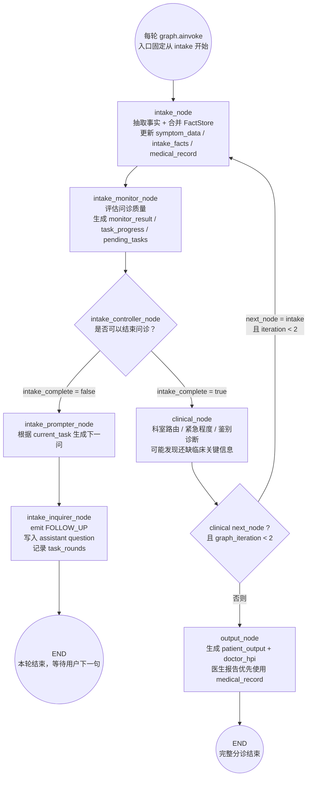
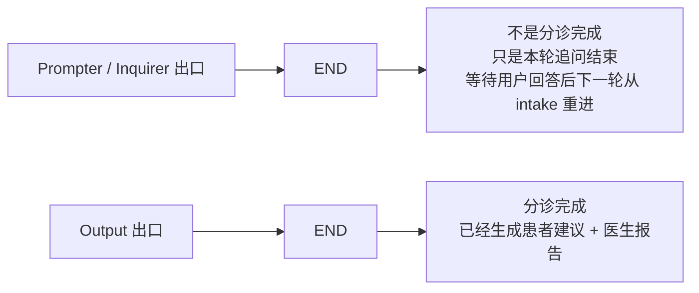
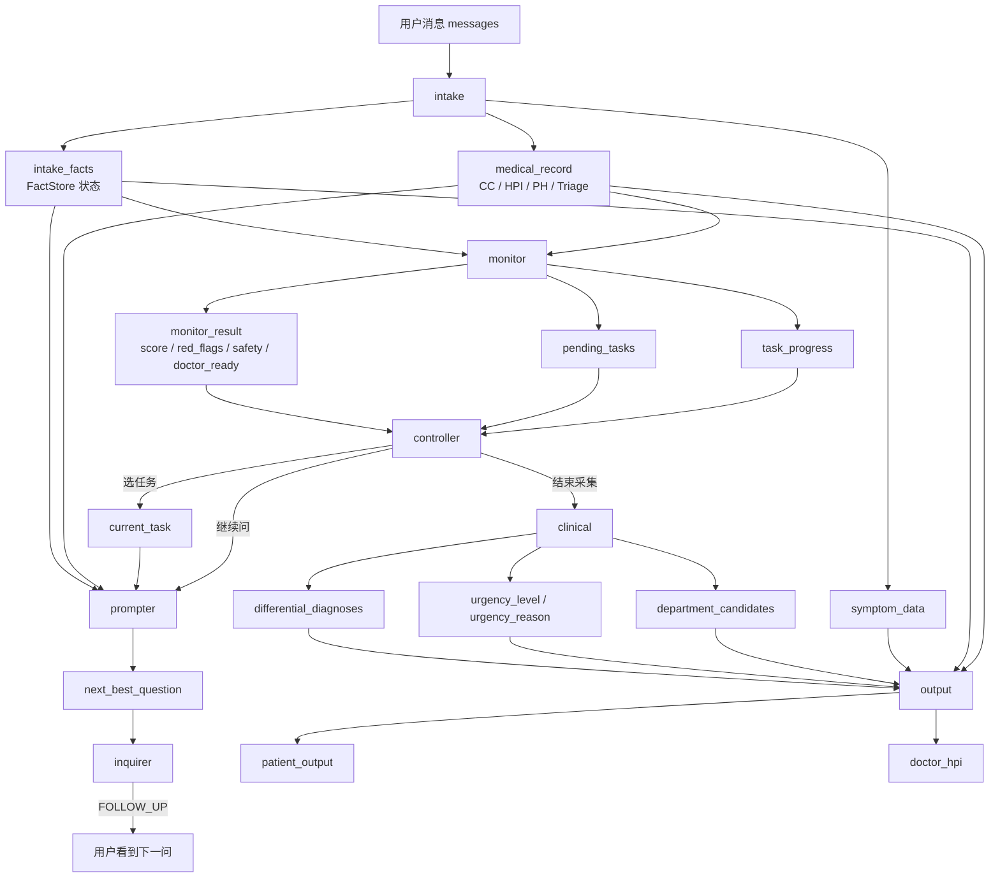

# 分诊 Agent LangGraph 学习笔记

这份笔记整理当前分诊 Agent 的核心设计、真实 LangGraph 流程、状态流转、关键文件阅读顺序，以及面试/讲解时可以抓住的设计亮点。

## 一句话概括

当前分诊 Agent 不是一次性 LLM 问诊链，而是一个跨轮状态机。每轮用户输入都会从 `intake` 重新进入，通过 `FactStore + medical_record + task_progress` 恢复上下文；如果信息不足，就走 `prompter -> inquirer -> END` 等用户回答；如果质量门通过，就走 `clinical -> output -> END` 完成分诊。

## 真实 LangGraph 流程

对应文件：`medi/agents/triage/graph/builder.py`

### 两种 END 的含义

`END` 在 LangGraph 里只表示“本次图执行结束”。它不等于整个分诊流程永久结束。对于追问分支，`END` 的作用是把控制权交还给外层 CLI/API，等待用户下一句；下一轮仍然会从 `intake` 重新进入，并通过 checkpointer 恢复状态。

## 核心状态流

## 当前架构的关键设计

### 1. 多节点拆分，而不是单体问诊节点

现在的问诊链路拆成多个职责清晰的节点：

- `intake`：抽取事实、合并事实、更新结构化病历。
- `monitor`：只评估质量，不做调度。
- `controller`：只决定是否继续，以及下一步推进哪个任务。
- `prompter`：把任务转成自然语言问题。
- `inquirer`：负责发出追问事件并结束本轮。
- `clinical`：做科室、紧急程度、鉴别诊断。
- `output`：生成患者建议和医生报告。

这样做的价值是降低 LLM 单节点同时负责“抽取、追问、判断、输出”的不可控性。

### 2. FactStore 是事实内存

对应文件：`medi/agents/triage/intake_facts.py`

`FactStore` 保存的不是纯文本聊天记录，而是结构化临床事实：

- `slot`：事实位置，例如 `hpi.onset`、`safety.allergies`。
- `status`：`present`、`absent`、`partial`、`unknown`、`not_applicable`。
- `value`：患者原话里的关键信息。
- `evidence`：证据文本。
- `confidence`：置信度。
- `source_turn`：来源轮次。

这个设计让系统可以区分“存在”“明确否认”“没问到”“回答不完整”，避免把所有内容压成一段自由文本。

### 3. medical_record 是可评分、可生成报告的病历草稿

对应文件：`medi/agents/triage/medical_record.py`

`medical_record` 把 `FactStore` 投影成四段式结构：

- `cc`：chief complaint，主诉。
- `hpi`：history of present illness，现病史。
- `ph`：past history，既往史和安全信息。
- `triage`：预分诊方向。

后续的 `monitor`、`controller`、`output` 都优先围绕这个结构工作。也就是说，系统不是只“记住聊天”，而是在对话过程中持续写一份医生可读的病历草稿。

### 4. 任务树调度替代固定问诊顺序

对应文件：

- `medi/agents/triage/task_definitions.py`
- `medi/agents/triage/task_progress.py`

任务被拆成四类：

- T1：科室识别。
- T2：现病史采集。
- T3：既往史和安全信息。
- T4：主诉生成。

每个任务用 `TaskRequirement` 映射到 `medical_record` 的语义路径，例如：

- `T2_ONSET` 看 `hpi.onset`、`hpi.timing`、`hpi.location`、`hpi.exposure_event`。
- `T3_CURRENT_MEDICATIONS` 看 `ph.current_medications`。
- `T2_GENERAL_CONDITION` 看儿童发热场景里的精神状态和饮水/尿量。

任务完成度不是 LLM 自己说了算，而是由 `medical_record` 中是否存在可用证据来计算。

### 5. Monitor 和 Controller 分离

对应文件：

- `medi/agents/triage/graph/nodes/intake_monitor_node.py`
- `medi/agents/triage/graph/nodes/intake_controller_node.py`

`monitor` 只负责产出质量信号：

- `score`
- `red_flags_checked`
- `safety_slots_covered`
- `doctor_summary_ready`
- `required_slots_covered`
- `high_value_missing_slots`
- `task_progress`
- `pending_tasks`

`controller` 再基于这些信号做调度：

- 选下一个最高价值任务。
- 判断是否允许结束问诊。
- 对关键任务加权。
- 对重复追问做惩罚。
- 避免红旗症状、安全信息未完成时提前放行。

这使得“评分”和“决策”可以分别测试和调参。

### 6. Safety-first 质量门

当前系统不会只因为轮数够多或总分超过某个阈值就结束问诊。尤其是儿童发热等场景，必须关注：

- 红旗症状是否排查。
- 当前用药和过敏是否覆盖。
- 医生摘要是否具备核心信息。
- 关键任务是否完成。

例如儿童发热场景中，`mental_status`、`intake_urination`、`current_medications` 不能被简单跳过，否则医生报告和患者建议都会缺少关键安全信息。

### 7. 确定性规则兜底 LLM 抽取

对应文件：`medi/agents/triage/intake_rules.py`

一些高价值事实不能完全依赖 LLM：

- 药名识别，例如布洛芬、对乙酰氨基酚。
- 过敏否认，例如“没有过敏史”。
- 当前用药否认，例如“没有吃药”。
- 短回答上下文理解，例如护士问“有没有检查/治疗”，患者答“没有”。
- 暴露事件与症状起病时间分离，例如“上周潜水没耳痛，今天耳朵刺痛”。

这些规则保证关键阴性事实和安全信息不会因为一次 LLM JSON 截断或抽取遗漏而丢失。

### 8. 最终输出优先依据结构化病历

对应文件：`medi/agents/triage/graph/nodes/output_node.py`

最终输出分两端：

- `patient_output`：面向患者的科室、紧急程度、建议、危险信号。
- `doctor_hpi`：面向医生的结构化预诊报告。

医生报告不再只依赖简短症状摘要，而是优先使用 `medical_record`，覆盖：

- 主诉
- HPI 叙述
- 起病时间、持续时间、部位、性质、严重程度
- 伴随症状和相关阴性
- 检查/诊断经过
- 治疗经过
- 一般情况
- 既往史
- 当前用药和过敏
- 分诊摘要
- 仍未采集项

`DoctorHpiBuilder` 还会在 LLM 漏写时从 `medical_record` 自动补齐关键事实。

## 文件阅读顺序

不要按目录顺序看，按状态流动顺序看。

### 第一轮：看骨架

1. `medi/agents/triage/graph/state.py`
2. `medi/agents/triage/graph/builder.py`
3. `medi/agents/triage/runner.py`

目标：搞清楚图有哪些节点、状态有哪些字段、跨轮状态如何恢复。

### 第二轮：看事实如何进入系统

4. `medi/agents/triage/graph/nodes/intake_node.py`
5. `medi/agents/triage/intake_facts.py`
6. `medi/agents/triage/intake_rules.py`
7. `medi/agents/triage/intake_protocols.py`

目标：搞清楚用户一句话如何变成结构化事实，以及协议/overlay 如何影响采集重点。

### 第三轮：看任务调度系统

8. `medi/agents/triage/task_definitions.py`
9. `medi/agents/triage/medical_record.py`
10. `medi/agents/triage/task_progress.py`
11. `medi/agents/triage/graph/nodes/intake_monitor_node.py`
12. `medi/agents/triage/graph/nodes/intake_controller_node.py`

目标：搞清楚系统怎么判断“还缺什么、下一轮问什么、什么时候能结束”。

### 第四轮：看追问生成

13. `medi/agents/triage/graph/nodes/intake_prompter_node.py`
14. `medi/agents/triage/graph/nodes/intake_inquirer_node.py`

目标：搞清楚任务如何转成自然语言追问，以及为什么追问后本轮走到 `END`。

### 第五轮：看临床推理和最终报告

15. `medi/agents/triage/graph/nodes/clinical_node.py`
16. `medi/agents/triage/department_router.py`
17. `medi/agents/triage/graph/nodes/output_node.py`

目标：搞清楚分诊结果、紧急程度、鉴别诊断、患者建议和医生报告如何生成。

## 配套测试阅读顺序

看完一块代码后，立刻看对应测试：

1. `tests/test_intake_rules.py`
2. `tests/test_medical_record.py`
3. `tests/test_task_definitions.py`
4. `tests/test_task_progress.py`
5. `tests/test_intake_controller_tasks.py`
6. `tests/test_intake_prompter_inquirer.py`
7. `tests/test_hpi_measurements.py`

测试比代码更容易看出设计意图，尤其是短回答否认、儿童发热安全门、医生报告补齐这些边界。

## 学习节奏建议

### 第一天：建立全局地图

看 `state.py -> builder.py -> runner.py`。

你只需要回答：

- 每个节点叫什么？
- 图怎么走？
- 哪些 state 是跨轮保留的？

### 第二天：掌握事实层

看 `intake_node.py -> intake_facts.py -> intake_rules.py -> intake_protocols.py`。

你只需要回答：

- 用户输入怎么变成 facts？
- `present/absent/partial/unknown` 有什么区别？
- 哪些事实必须用规则兜底？

### 第三天：掌握任务调度

看 `task_definitions.py -> medical_record.py -> task_progress.py -> monitor -> controller`。

你只需要回答：

- T1/T2/T3/T4 分别是什么？
- 一个任务如何判断完成？
- Controller 为什么选择这个任务而不是另一个？
- 什么情况下绝不能提前结束？

### 第四天：走完闭环

看 `prompter -> inquirer -> clinical -> output`。

你只需要回答：

- 任务怎么变成问题？
- 为什么追问后进入 `END`？
- 临床推理结果怎么进最终报告？
- 医生报告怎么防止漏掉已采集信息？

## 每看一个文件都问三个问题

1. 它读哪些 state？
2. 它写哪些 state？
3. 它的决策是确定性的，还是交给 LLM 的？

这三个问题串起来，就能真正讲清楚整个分诊 Agent。

## 面试讲解版本

可以这样讲：

> 我把分诊 Agent 从单体式 LLM 问诊升级成了 LangGraph 多节点状态机。每轮对话先由 intake 抽取事实并写入 FactStore，再投影成 CC/HPI/PH/Triage 四段式 medical_record。Monitor 根据 medical_record 计算任务完成度、红旗覆盖、安全信息覆盖和医生摘要就绪度；Controller 根据任务优先级、关键任务标记和重复追问惩罚选择下一轮最高价值任务。信息不足时走 prompter/inquirer 生成追问并结束本轮等待用户，质量门通过后才进入 clinical 和 output，最终同时生成患者建议和医生预诊报告。

这段讲解的重点是：这不是普通聊天机器人，而是一个可评分、可追问、可恢复、可安全拦截的医疗预问诊状态机。
